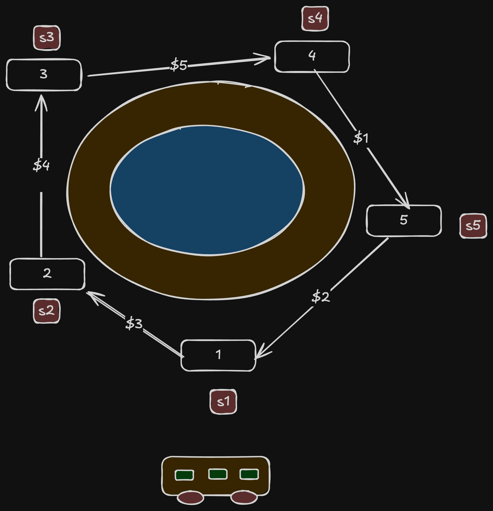
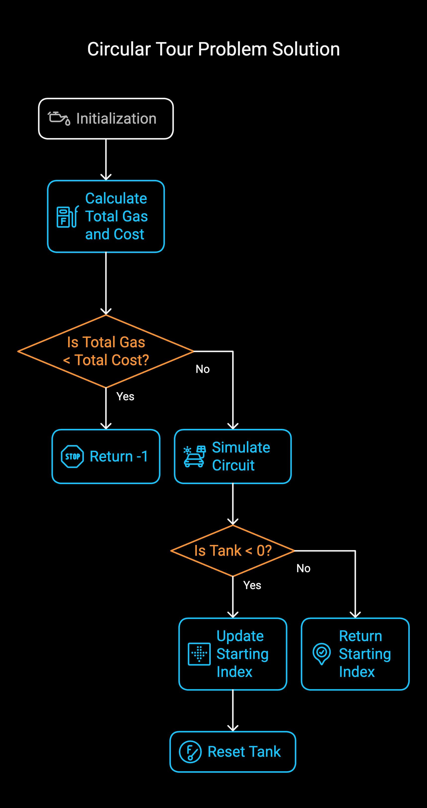

# Problem

- [134. Gas Station](https://leetcode.com/problems/gas-station/description/)`Medium`

## Intuition:

Imagine you have a circular route with gas stations. Each station provides a certain amount of gas (`gas[i]`), and it costs a certain amount of gas to travel from station i to the next station (`cost[i]`). You start with an empty tank. The goal is to find a starting station such that you can complete the entire circuit.

```plain
Example 1:

Input: gas = [1,2,3,4,5], cost = [3,4,5,1,2]
Output: 3
Explanation:
Start at station 3 (index 3) and fill up with 4 unit of gas. Your tank = 0 + 4 = 4
Travel to station 4. Your tank = 4 - 1 + 5 = 8
Travel to station 0. Your tank = 8 - 2 + 1 = 7
Travel to station 1. Your tank = 7 - 3 + 2 = 6
Travel to station 2. Your tank = 6 - 4 + 3 = 5
Travel to station 3. The cost is 5. Your gas is just enough to travel back to station 3.
Therefore, return 3 as the starting index.
Example 2:

Input: gas = [2,3,4], cost = [3,4,3]
Output: -1
Explanation:
You can't start at station 0 or 1, as there is not enough gas to travel to the next station.
Let's start at station 2 and fill up with 4 unit of gas. Your tank = 0 + 4 = 4
Travel to station 0. Your tank = 4 - 3 + 2 = 3
Travel to station 1. Your tank = 3 - 3 + 3 = 3
You cannot travel back to station 2, as it requires 4 unit of gas but you only have 3.
Therefore, you can't travel around the circuit once no matter where you start.
```
### Algorithm :

**Problem:** Given an array `gas` representing the amount of gas at each gas station and an array `cost` representing the cost to travel from station `i` to `i+1`, find a starting station index such that you can complete a circular tour.

**Algorithm:**

1.  **Initialization:**
    * `tank` = 0 (current gas in tank)
    * `index` = 0 (potential starting station index)
    * `total_gas` = 0 (sum of all gas)
    * `total_cost` = 0 (sum of all costs)

2. Circuit Completion Algorithm **Calculate Total Gas and Cost:**
    * Iterate through the `gas` and `cost` arrays:
        * `total_gas` += `gas[i]`
        * `total_cost` += `cost[i]`

3.  **Check for Feasibility:**
    * If `total_gas` < `total_cost`, return -1 (no solution exists).

4.  **Simulate Circuit and Find Starting Point:**
    * Iterate through the `gas` and `cost` arrays:
        * `tank` += `gas[i]` - `cost[i]` (update tank with net gas gain/loss)
        * If `tank` < 0:
            * `index` = `i` + 1 (update starting index)
            * `tank` = 0 (reset tank)

5.  **Return Starting Index:**
    * Return `index` (the starting station index).


## Approaches

# Greedy


<code>Complexity</code>

- Time complexity: O(n)
- space complexity: O(1)


#### Solution
```cpp
#include <stdio.h>
int canCompleteCircuit(int *gas, int gasSize, int *cost, int costSize)
{
	// current amount of gas in the tank.
	int tank = 0;
	// 'index' stores the starting index.
	int index = 0;
	// stores the sum of all gas available.
	int total_gas = 0;
	// stores the sum of all costs.
	int total_cost = 0;

	for (int i = 0; i < gasSize; i++) {
		// Calculate the total gas and total cost.
		total_gas += gas[i];
		total_cost += cost[i];
		// Update the tank with the difference between
		//gas and cost at the current station.
		tank += gas[i] - cost[i];

		// If the tank becomes negative,
		//it means we cannot start from the current 'index' and reach the current station.
		// So, we update the 'index'
		if (tank < 0) {
			index = i + 1;
			tank = 0;
		}
	}

	// If the total gas is less than the total cost,
	//it means it's impossible to complete the circuit.
	// Otherwise, return the 'index' where we can start the circuit.
	return (total_gas < total_cost) ? -1 : index;
}
int main()
{
	int gas[] = {1,2,3,4,5};
	int cost[] = {3,4,5,1,2};
	int gasSize = sizeof(gas) / sizeof(gas[0]);
	int costSize = sizeof(cost) / sizeof(cost[0]);
	printf("%d", canCompleteCircuit(gas, gasSize, cost, costSize));
	return 0;
}
```


## Dry Run: Gas Station Circuit Completion

**Example 1: gas = [1, 2, 3, 4, 5], cost = [3, 4, 5, 1, 2]**

1.  **Initialization:**
    * `tank` = 0
    * `index` = 0
    * `total_gas` = 1 + 2 + 3 + 4 + 5 = 15
    * `total_cost` = 3 + 4 + 5 + 1 + 2 = 15

2.  **Check Feasibility:**
    * `total_gas` (15) is not less than `total_cost` (15). Continue.

3.  **Simulate Circuit:**
    * **i = 0:**
        * `tank` = 0 + (1 - 3) = -2
        * `tank` < 0, so `index` = 1, `tank` = 0
    * **i = 1:**
        * `tank` = 0 + (2 - 4) = -2
        * `tank` < 0, so `index` = 2, `tank` = 0
    * **i = 2:**
        * `tank` = 0 + (3 - 5) = -2
        * `tank` < 0, so `index` = 3, `tank` = 0
    * **i = 3:**
        * `tank` = 0 + (4 - 1) = 3
    * **i = 4:**
        * `tank` = 3 + (5 - 2) = 6

4.  **Return Index:**
    * Return `index` = 3

**Example 2: gas = [2, 3, 4], cost = [3, 4, 3]**

1.  **Initialization:**
    * `tank` = 0
    * `index` = 0
    * `total_gas` = 2 + 3 + 4 = 9
    * `total_cost` = 3 + 4 + 3 = 10

2.  **Check Feasibility:**
    * `total_gas` (9) < `total_cost` (10). Return -1.

3.  **Return Index:**
    * Return -1.