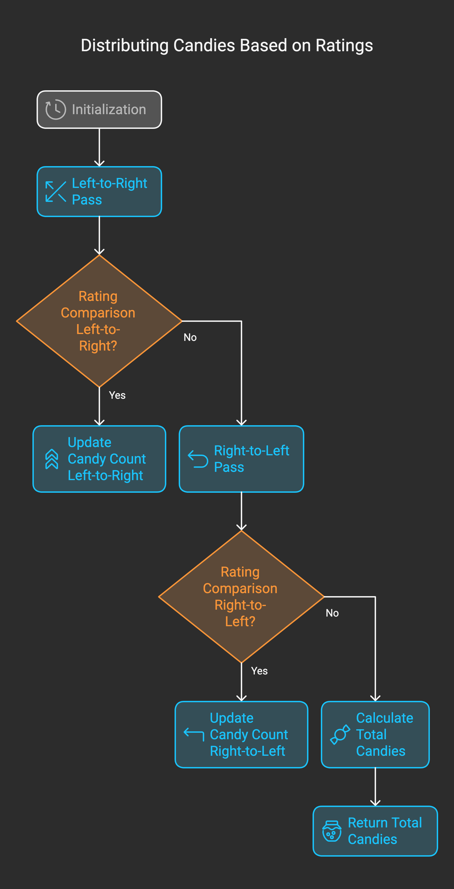
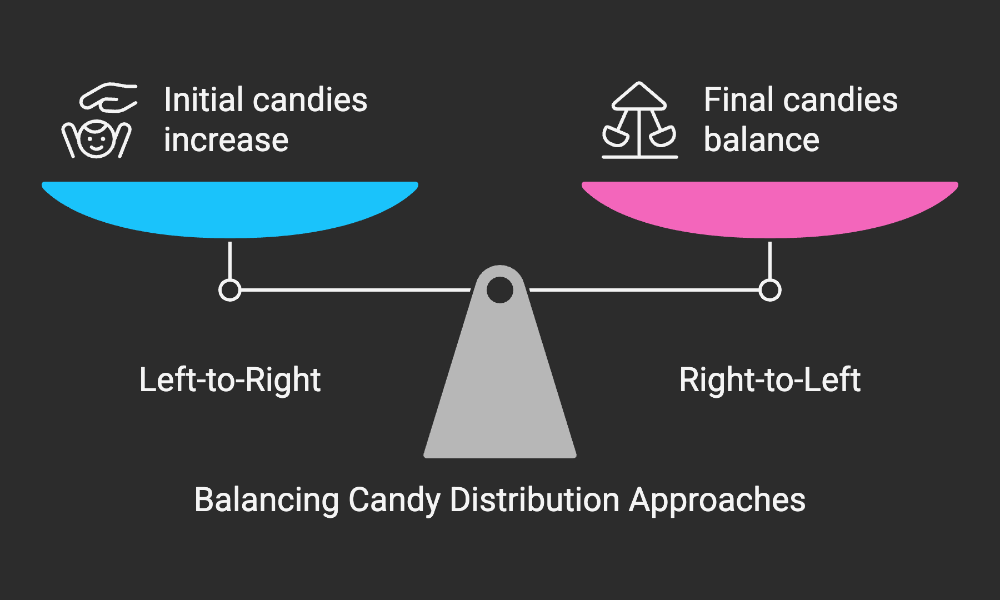
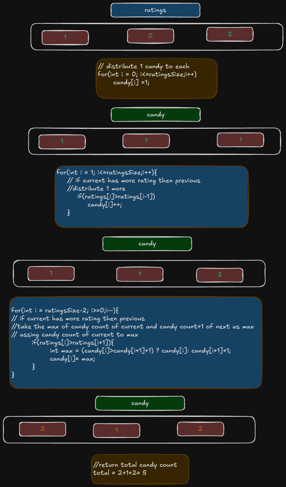

# Problem

- [135. Candy](https://leetcode.com/problems/gas-station/description/)`Medium`

## Intuition:

**Problem:** Given an array ratings representing children's ratings, distribute candies such that:

Each child gets at least one candy.
Children with higher ratings get more candies than their neighbors.


```plain
Example 1:

Input: ratings = [1,0,2]
Output: 5
Explanation: You can allocate to the first, second and third child with 2, 1, 2 candies respectively.
Example 2:

Input: ratings = [1,2,2]
Output: 4
Explanation: You can allocate to the first, second and third child with 1, 2, 1 candies respectively.
The third child gets 1 candy because it satisfies the above two conditions.
```
### Algorithm :

**Steps:**

1.  **Initialization:**
    * `ratingsSize` = length of `ratings`.
    * `candy` = array of size `ratingsSize`, initialized with 1 for each element.
    * `total` = 0 (to store the total candies).

2.  **Left-to-Right Pass:**
    * For `i` from 1 to `ratingsSize - 1`:
        * If `ratings[i]` > `ratings[i - 1]`:
            * `candy[i] = candy[i - 1] + 1`.

3.  **Right-to-Left Pass:**
    * For `i` from `ratingsSize - 2` down to 0:
        * If `ratings[i]` > `ratings[i + 1]`:
            * `candy[i] = max(candy[i], candy[i + 1] + 1)`.

4.  **Calculate Total Candies:**
    * For `i` from 0 to `ratingsSize - 1`:
        * `total` = `total` + `candy[i]`.

5.  **Return Total Candies:**
    * Return `total`.



## Approaches

# Greedy


<code>Complexity</code>

- Time complexity: O(n)
- space complexity: O(n)


#### Solution
```cpp
class Solution {
public:
    int candy(vector<int>& ratings) {
        int n = ratings.size();
        vector<int> candies(n, 1);

        for (int i = 1; i < n; ++i) {
            if (ratings[i] > ratings[i - 1]) {
                candies[i] = candies[i - 1] + 1;
            }
        }

        for (int i = n - 2; i >= 0; --i) {
            if (ratings[i] > ratings[i + 1]) {
                candies[i] = max(candies[i], candies[i + 1] + 1);
            }
        }

        return accumulate(candies.begin(), candies.end(), 0);
    }
};
```


# Dry Run: Distribute Candies

**Example 1:**

**Input:** `ratings = [1, 0, 2]`

**Steps:**

1.  **Initialization:**
    * `ratingsSize = 3`
    * `candy = [1, 1, 1]`
    * `total = 0`

2.  **Left-to-Right Pass:**
    * `i = 1`: `ratings[1] (0) < ratings[0] (1)`. `candy` remains `[1, 1, 1]`.
    * `i = 2`: `ratings[2] (2) > ratings[1] (0)`. `candy[2] = candy[1] + 1 = 2`. `candy` becomes `[1, 1, 2]`.

3.  **Right-to-Left Pass:**
    * `i = 1`: `ratings[1] (0) < ratings[2] (2)`. `candy` remains `[1, 1, 2]`.
    * `i = 0`: `ratings[0] (1) > ratings[1] (0)`. `candy[0] = max(candy[0], candy[1] + 1) = max(1, 2) = 2`. `candy` becomes `[2, 1, 2]`.

4.  **Calculate Total:**
    * `total = 2 + 1 + 2 = 5`

5.  **Return `total`:**
    * `5`

**Example 2:**

**Input:** `ratings = [1, 2, 2]`

**Steps:**

1.  **Initialization:**
    * `ratingsSize = 3`
    * `candy = [1, 1, 1]`
    * `total = 0`

2.  **Left-to-Right Pass:**
    * `i = 1`: `ratings[1] (2) > ratings[0] (1)`. `candy[1] = candy[0] + 1 = 2`. `candy` becomes `[1, 2, 1]`.
    * `i = 2`: `ratings[2] (2) == ratings[1] (2)`. `candy` remains `[1, 2, 1]`.

3.  **Right-to-Left Pass:**
    * `i = 1`: `ratings[1] (2) == ratings[2] (2)`. `candy` remains `[1, 2, 1]`.
    * `i = 0`: `ratings[0] (1) < ratings[1] (2)`. `candy` remains `[1, 2, 1]`.

4.  **Calculate Total:**
    * `total = 1 + 2 + 1 = 4`

5.  **Return `total`:**
    * `4`