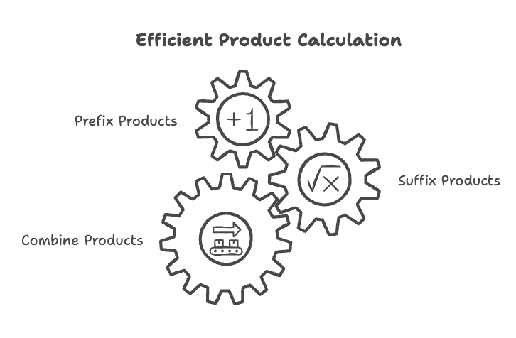
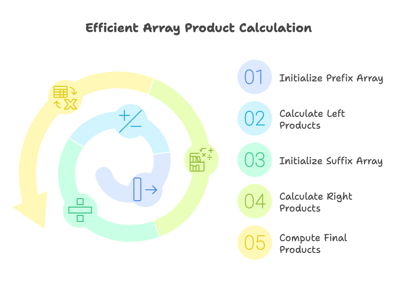
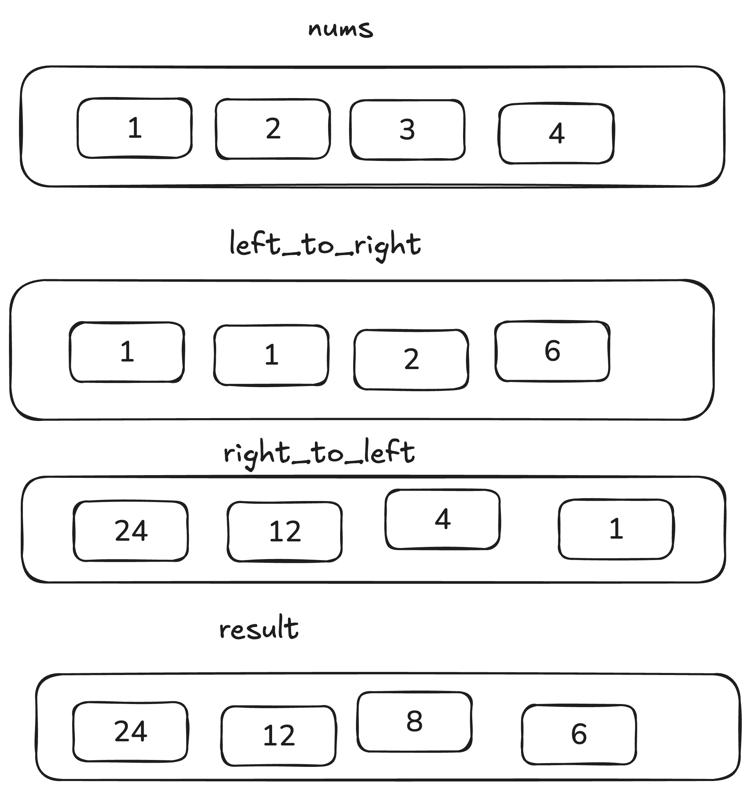

# Problem

- [238. Product of Array Except Self](https://leetcode.com/problems/product-of-array-except-self/)`Medium`

## Intuition:

**Problem:** Given an array `nums`, you need to produce a new array where each element is the product of all other elements in nums, excluding the element at that index.

**The Challenge:**

The obvious approach (multiplying all elements and dividing by the current element) has a problem: it doesn't work when `nums` contains zeros or `nums` contation large number where multiplication result doesn't contains in int range. We need a robust solution.

**The Insight:** Breaking Down the Problem

Instead of trying to calculate the product directly for each element, we can break it down into two simpler sub-problems:

**Products to the Left:** For each element, calculate the product of all elements to its left.
**Products to the Right:** For each element, calculate the product of all elements to its right.

```plain
Example 1:

Input: nums = [1,2,3,4]
Output: [24,12,8,6]
Example 2:

Input: nums = [-1,1,0,-3,3]
Output: [0,0,9,0,0]
```
### Algorithm :

# Intuition: Product of Array Except Self

**Problem:** Given an array `nums`, return an array `answer` such that `answer[i]` is equal to the product of all the elements of `nums` except `nums[i]`.

**Naive Approach (and Why It's Inefficient):**

* A simple way is to iterate through `nums`, and for each element, calculate the product of all other elements. This would involve nested loops, leading to $O(n^2)$ time complexity.

**Efficient Approach (Using Prefix and Suffix Products):**

The key is to avoid redundant multiplications. We can do this by pre-calculating prefix and suffix products.

1.  **Left-to-Right Products (Prefix Products):**
    * Create an array `left_to_right` of the same size as `nums`.
    * `left_to_right[i]` will store the product of all elements to the *left* of `nums[i]`.
    * Initialize `left_to_right[0]` to 1 (because there are no elements to the left of the first element).
    * Iterate from left to right, calculating the prefix product at each step.

2.  **Right-to-Left Products (Suffix Products):**
    * Create an array `right_to_left` of the same size as `nums`.
    * `right_to_left[i]` will store the product of all elements to the *right* of `nums[i]`.
    * Initialize `right_to_left[size - 1]` to 1 (because there are no elements to the right of the last element).
    * Iterate from right to left, calculating the suffix product at each step.

3.  **Calculate the Result:**
    * Iterate through `nums` once more.
    * For each element `nums[i]`, the product of all elements except itself is simply `left_to_right[i] * right_to_left[i]`.
    * Store this product in the `left_to_right` array (which will be our final result).

**Why This Works:**

* **Prefix Products:** By calculating prefix products, we avoid repeatedly multiplying elements to the left of each `nums[i]`.
* **Suffix Products:** Similarly, suffix products avoid redundant multiplications for elements to the right.
* **Combining Products:** Multiplying the left and right products gives us the desired result without including `nums[i]` in the calculation.

**Example Breakdown:**

Let's say `nums = [1, 2, 3, 4]`.

1.  `left_to_right` will be `[1, 1, 2, 6]`.
2.  `right_to_left` will be `[24, 12, 4, 1]`.
3.  The final result will be `[24, 12, 8, 6]`.




## Approaches

# Intuition: Product of Array Except Self

**Problem:** Given an array `nums`, return an array `answer` such that `answer[i]` is equal to the product of all the elements of `nums` except `nums[i]`.

**Naive Approach (and Why It's Inefficient):**

* A simple way is to iterate through `nums`, and for each element, calculate the product of all other elements. This would involve nested loops, leading to $O(n^2)$ time complexity.

**Efficient Approach (Using Prefix and Suffix Products):**

The key is to avoid redundant multiplications. We can do this by pre-calculating prefix and suffix products.

1.  **Left-to-Right Products (Prefix Products):**
    * Create an array `left_to_right` of the same size as `nums`.
    * `left_to_right[i]` will store the product of all elements to the *left* of `nums[i]`.
    * Initialize `left_to_right[0]` to 1 (because there are no elements to the left of the first element).
    * Iterate from left to right, calculating the prefix product at each step.

2.  **Right-to-Left Products (Suffix Products):**
    * Create an array `right_to_left` of the same size as `nums`.
    * `right_to_left[i]` will store the product of all elements to the *right* of `nums[i]`.
    * Initialize `right_to_left[size - 1]` to 1 (because there are no elements to the right of the last element).
    * Iterate from right to left, calculating the suffix product at each step.

3.  **Calculate the Result:**
    * Iterate through `nums` once more.
    * For each element `nums[i]`, the product of all elements except itself is simply `left_to_right[i] * right_to_left[i]`.
    * Store this product in the `left_to_right` array (which will be our final result).

**Why This Works:**

* **Prefix Products:** By calculating prefix products, we avoid repeatedly multiplying elements to the left of each `nums[i]`.
* **Suffix Products:** Similarly, suffix products avoid redundant multiplications for elements to the right.
* **Combining Products:** Multiplying the left and right products gives us the desired result without including `nums[i]` in the calculation.

**Example Breakdown:**

Let's say `nums = [1, 2, 3, 4]`.

1.  `left_to_right` will be `[1, 1, 2, 6]`.
2.  `right_to_left` will be `[24, 12, 4, 1]`.
3.  The final result will be `[24, 12, 8, 6]`.

**In simpler terms:**


<code>Complexity</code>

- Time complexity: O(n)
- space complexity: O(n)





#### Solution
```cpp
#include<bits/stdc++.h>
using namespace std;
class Solution {
public:
	vector<int> productExceptSelf(vector<int>& nums) {

		int size = nums.size();
		vector<int> left_to_right(size), right_to_left(size);

		left_to_right[0] = 1;
		int prefix_sum = 1;

		for(int i =1; i<nums.size(); i++)
		{
			prefix_sum*=nums[i-1];
			left_to_right[i] = prefix_sum;
		}

		right_to_left[size-1] = 1;
		prefix_sum = 1;

		for(int i =size-2; i>=0; i--)
		{
			prefix_sum*=nums[i+1];
			right_to_left[i] = prefix_sum;

		}

		for(int i =0; i<nums.size(); i++)
			left_to_right[i] = left_to_right[i] *  right_to_left[i];


		return left_to_right;


	}
};
int main()
{
	vector<int> nums = {-1,1,0,-3,3};
	vector<int> res ;

	Solution sol;
	res = sol.productExceptSelf(nums);
	for(auto i:res)
		cout<<i<<" ";
	return 0;
}
```

# Dry Run: Product of Array Except Self

**Example 1:**

**Input:** `nums = [1, 2, 3, 4]`

**Steps:**

1.  **Initialization:**
    * `size = 4`
    * `left_products = [1, 1, 1, 1]`
    * `right_products = [1, 1, 1, 1]`
    * `result = [0, 0, 0, 0]` (or initially an array of the correct size)

2.  **Calculate `left_products`:**
    * `left_products[0] = 1`
    * `prefix_product = 1`
    * `i = 1`: `prefix_product = 1 * nums[0] = 1`, `left_products[1] = 1`
    * `i = 2`: `prefix_product = 1 * nums[1] = 2`, `left_products[2] = 2`
    * `i = 3`: `prefix_product = 2 * nums[2] = 6`, `left_products[3] = 6`
    * `left_products` becomes `[1, 1, 2, 6]`

3.  **Calculate `right_products`:**
    * `right_products[3] = 1`
    * `suffix_product = 1`
    * `i = 2`: `suffix_product = 1 * nums[3] = 4`, `right_products[2] = 4`
    * `i = 1`: `suffix_product = 4 * nums[2] = 12`, `right_products[1] = 12`
    * `i = 0`: `suffix_product = 12 * nums[1] = 24`, `right_products[0] = 24`
    * `right_products` becomes `[24, 12, 4, 1]`

4.  **Calculate `result`:**
    * `i = 0`: `result[0] = left_products[0] * right_products[0] = 1 * 24 = 24`
    * `i = 1`: `result[1] = left_products[1] * right_products[1] = 1 * 12 = 12`
    * `i = 2`: `result[2] = left_products[2] * right_products[2] = 2 * 4 = 8`
    * `i = 3`: `result[3] = left_products[3] * right_products[3] = 6 * 1 = 6`
    * `result` becomes `[24, 12, 8, 6]`

5.  **Return `result`:**
    * `[24, 12, 8, 6]`

**Example 2:**

**Input:** `nums = [-1, 1, 0, -3, 3]`

**Steps:**

1.  **Initialization:**
    * `size = 5`
    * `left_products = [1, 1, 1, 1, 1]`
    * `right_products = [1, 1, 1, 1, 1]`
    * `result = [0, 0, 0, 0, 0]`

2.  **Calculate `left_products`:**
    * `left_products = [1, -1, -1, 0, 0]`

3.  **Calculate `right_products`:**
    * `right_products = [0, 0, -9, 3, 1]`

4.  **Calculate `result`:**
    * `result = [0, 0, 9, 0, 0]`

5.  **Return `result`:**
    * `[0, 0, 9, 0, 0]`
  

