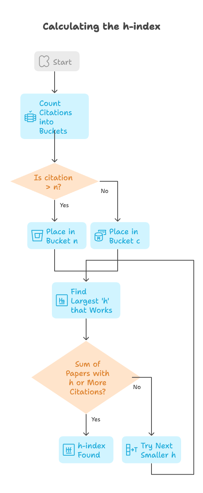
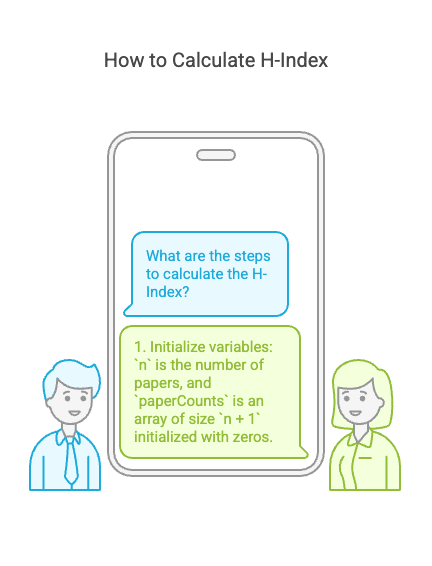

# Problem

- [274. H-Index](https://leetcode.com/problems/h-index/)`Medium`

## Intuition:

**Problem:** Given an array `citations`, find the h-index.

**Understanding H-Index:**

The h-index is the largest number `h` such that at least `h` papers have `h` or more citations.

**Intuitive Explanation:**

1.  **Count Citations into Buckets:**
    * Think of having "buckets" labeled from 0 to `n` (where `n` is the number of papers).
    * We go through each citation in `citations`.
    * For each citation `c`:
        * If `c` is greater than `n`, put it in the bucket labeled `n` (because we only care about citations up to `n`).
        * Otherwise, put it in the bucket labeled `c`.
    * This gives us a count of how many papers have each number of citations (or more than `n`).

2.  **Find the Largest 'h' that Works:**
    * We start with the largest possible `h`, which is `n`.
    * We then check if we have at least `h` papers with `h` or more citations.
    * To do this, we add up the counts of papers in buckets `h`, `h+1`, ..., `n`.
    * If the sum is greater than or equal to `h`, we've found our h-index.
    * If not, we try the next smaller value of `h` (i.e., `h-1`) and repeat.


```plain
Example 1:

Input: citations = [3,0,6,1,5]
Output: 3
Explanation: [3,0,6,1,5] means the researcher has 5 papers in total and each of them had received 3, 0, 6, 1, 5 citations respectively.
Since the researcher has 3 papers with at least 3 citations each and the remaining two with no more than 3 citations each, their h-index is 3.
Example 2:

Input: citations = [1,3,1]
Output: 1

```
### Algorithm :


**Input:** An array `citations` of citation counts.

**Output:** The h-index of the researcher.

**Steps:**

1.  **Initialize Variables:**
    * `n` = the number of papers (size of `citations`).
    * `paperCounts` = an array of size `n + 1`, initialized with all zeros. This array will store the count of papers with at least `i` citations, where `i` is the index.

2.  **Count Citations:**
    * For each `c` in `citations`:
        * `paperCounts[min(n, c)]++`. This increments the count of papers with at least `min(n, c)` citations.

3.  **Find H-Index:**
    * `h` = `n` (start with the maximum possible h-index).
    * `papers` = `paperCounts[n]` (initialize the count of papers with at least `n` citations).
    * While `papers` is less than `h`:
        * Decrement `h` by 1 (`h--`).
        * Add `paperCounts[h]` to `papers` (`papers += paperCounts[h]`).

4.  **Return Result:**
    * Return `h`.




## Approaches

### Greedy Approach: 

<code>Complexity</code>

- Time complexity: O(n)
- space complexity: O(n)



#### Solution
```cpp
#include <bits/stdc++.h>
using namespace std;
class Solution {
public:
	int hIndex(vector<int>& citations) {
		// Get the number of citations.
		int n = citations.size();

		// Create a vector to store the count of papers with at least 'i' citations.
		// The size is n + 1 because a paper can have up to n citations.
		vector<int> paperCounts(n + 1, 0);

		// Populate the paperCounts vector.
		// For each citation 'c', increment the count at min(n, c).
		// If c > n, it means the paper has more than n citations, which is considered n for h-index.
		for (int c : citations) {
			paperCounts[min(n, c)]++;
		}

		// Initialize the h-index to n (the maximum possible h-index).
		int h = n;

		// Initialize the count of papers with at least 'n' citations.
		int papers = paperCounts[n];

		// Decrement 'h' until the number of papers with at least 'h' citations is >= 'h'.
		while (papers < h) {
			// Decrement h to find the next possible h-index.
			h--;

			// Add the count of papers with 'h' citations to the total count of papers.
			papers += paperCounts[h];
		}

		// Return the final h-index.
		return h;
	}
};
int main()
{
	vector<int> citations = {3,0,6,1,5};

	Solution s;
	cout<<s.hIndex(citations)<<endl;

	return 0;
}

```

# Dry Run: H-Index Calculation

**Input:** `citations = [3, 0, 6, 1, 5]`

**Steps:**

1.  **Initialization:**
    * `n = 5` (number of papers)
    * `paperCounts = [0, 0, 0, 0, 0, 0]` (initialized with 6 zeros)

2.  **Populate `paperCounts`:**
    * **c = 3:** `paperCounts[min(5, 3)] = paperCounts[3]++` -> `paperCounts = [0, 0, 0, 1, 0, 0]`
    * **c = 0:** `paperCounts[min(5, 0)] = paperCounts[0]++` -> `paperCounts = [1, 0, 0, 1, 0, 0]`
    * **c = 6:** `paperCounts[min(5, 6)] = paperCounts[5]++` -> `paperCounts = [1, 0, 0, 1, 0, 1]`
    * **c = 1:** `paperCounts[min(5, 1)] = paperCounts[1]++` -> `paperCounts = [1, 1, 0, 1, 0, 1]`
    * **c = 5:** `paperCounts[min(5, 5)] = paperCounts[5]++` -> `paperCounts = [1, 1, 0, 1, 0, 2]`

    * `paperCounts = [1, 1, 0, 1, 0, 2]`

3.  **Find H-Index:**
    * `h = 5`
    * `papers = paperCounts[5] = 2`

    * **While loop:**
        * `papers < h` (2 < 5) is true.
        * `h = 4`
        * `papers = papers + paperCounts[4] = 2 + 0 = 2`
        * `papers < h` (2 < 4) is true.
        * `h = 3`
        * `papers = papers + paperCounts[3] = 2 + 1 = 3`
        * `papers < h` (3 < 3) is false.

4.  **Return `h`:**
    * Return `h = 3`

**Result:**

The h-index is 3.

# Dry Run: H-Index Calculation

**Input:** `citations = [1, 3, 1]`

**Steps:**

1.  **Initialization:**
    * `n = citations.size() = 3`
    * `paperCounts = [0, 0, 0, 0]` (initialized with size `n + 1`)

2.  **Populate `paperCounts`:**
    * **`c = 1`:** `min(n, c) = min(3, 1) = 1`. `paperCounts[1]++`. `paperCounts` becomes `[0, 1, 0, 0]`.
    * **`c = 3`:** `min(n, c) = min(3, 3) = 3`. `paperCounts[3]++`. `paperCounts` becomes `[0, 1, 0, 1]`.
    * **`c = 1`:** `min(n, c) = min(3, 1) = 1`. `paperCounts[1]++`. `paperCounts` becomes `[0, 2, 0, 1]`.

    * Now, `paperCounts = [0, 2, 0, 1]`

3.  **Find H-Index:**
    * `h = n = 3`
    * `papers = paperCounts[3] = 1`

    * **`while (papers < h)`:**
        * `1 < 3` is true.
        * `h--`. `h` becomes 2.
        * `papers += paperCounts[2]`. `papers = 1 + 0 = 1`.

    * **`while (papers < h)`:**
        * `1 < 2` is true.
        * `h--`. `h` becomes 1.
        * `papers += paperCounts[1]`. `papers = 1 + 2 = 3`.

    * **`while (papers < h)`:**
        * `3 < 1` is false.
        * The loop terminates.

4.  **Return `h`:**
    * `h = 1`

**Output:** `1`