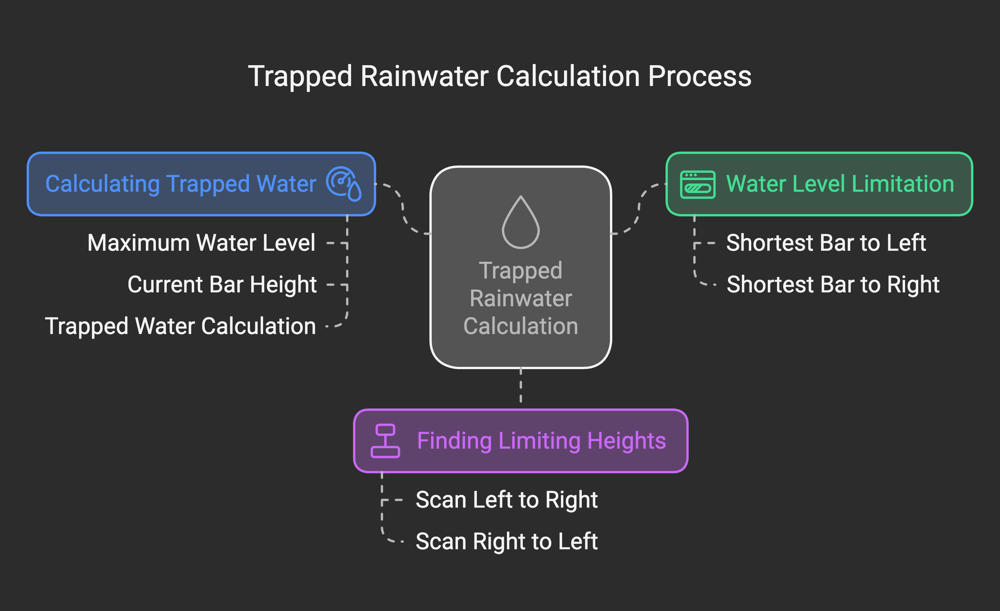
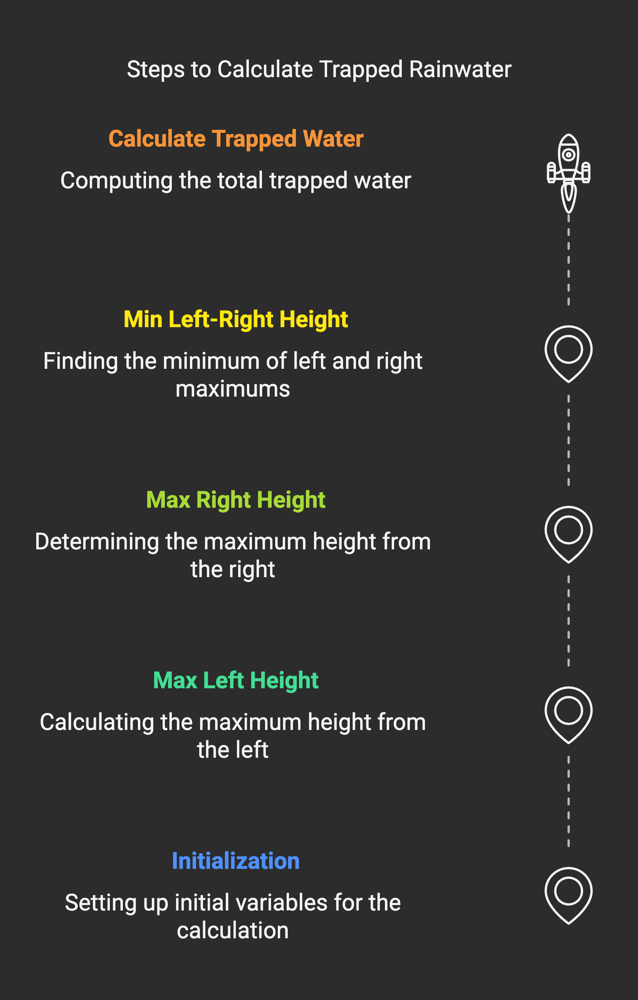
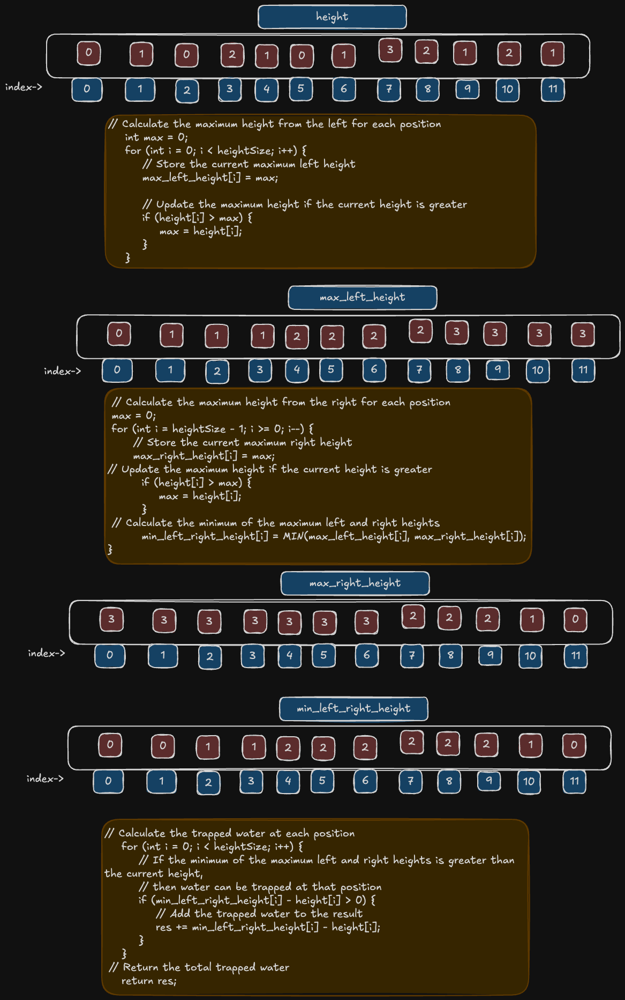

# Problem

- [42. Trapping Rain Water](https://leetcode.com/problems/trapping-rain-water/)`hard`

## Intuition:

**Water Level is Limited:** The amount of water that can be held at any position is limited by the shortest of the tallest bars to its left and right. Think of it like a container: the water level can only rise to the height of the shortest side.

**Finding the Limiting Heights:**

To find the tallest bar to the left of each position, we scan the array from left to right, keeping track of the maximum height seen so far.
Similarly, to find the tallest bar to the right, we scan from right to left, tracking the maximum height.

**Calculating Trapped Water:**

For each position, we determine the minimum of the tallest left and right bars. This minimum represents the maximum water level that can be held at that position.
If this maximum water level is higher than the current bar's height, then water can be trapped.
The amount of trapped water at that position is the difference between the maximum water level and the bar's height.

**Visualizing the Solution:**

Imagine pouring water over the landscape.
The water will fill the "valleys" between the bars, but it won't overflow the shortest of the tallest bars on either side.
By calculating the amount of water trapped at each position and summing them up, we get the total trapped rainwater.



```plain
Example 01:
Input: height = [0,1,0,2,1,0,1,3,2,1,2,1]
Output: 6
Explanation: The above elevation map (black section) is represented by array [0,1,0,2,1,0,1,3,2,1,2,1]. In this case, 6 units of rain water (blue section) are being trapped.
Example 2:

Input: height = [4,2,0,3,2,5]
Output: 9
```
### Algorithm :

1.  **Initialization:**
    * `res` = 0 (total trapped water)
    * `max_left_height` = array of size `heightSize` (maximum height from left)
    * `max_right_height` = array of size `heightSize` (maximum height from right)
    * `min_left_right_height` = array of size `heightSize` (minimum of left and right max heights)

2.  **Calculate `max_left_height`:**
    * `max` = 0
    * **For** `i` **from** 0 **to** `heightSize - 1`:
        * `max_left_height[i]` = `max`
        * **If** `height[i]` > `max`:
            * `max` = `height[i]`

3.  **Calculate `max_right_height` and `min_left_right_height`:**
    * `max` = 0
    * **For** `i` **from** `heightSize - 1` **to** 0:
        * `max_right_height[i]` = `max`
        * **If** `height[i]` > `max`:
            * `max` = `height[i]`
        * `min_left_right_height[i]` = `min(max_left_height[i], max_right_height[i])`

4.  **Calculate Trapped Water:**
    * **For** `i` **from** 0 **to** `heightSize - 1`:
        * **If** `min_left_right_height[i]` > `height[i]`:
            * `res` = `res` + (`min_left_right_height[i]` - `height[i]`)

5.  **Return:**
    * Return `res` (total trapped water)




## Approaches

<code>Complexity</code>

- Time complexity: O(n)
- space complexity: O(n)


#### Solution
```c
#include <stdio.h>

// Macro to find the minimum of two values
#define MIN(a, b) ((a < b) ? (a) : (b))

// Function to calculate the amount of trapped rainwater
int trap(int *height, int heightSize) {
    // Initialize the result to 0
    int res = 0;

    // Arrays to store the maximum height encountered from the left and right
    int max_left_height[heightSize];
    int max_right_height[heightSize];

    // Array to store the minimum of the maximum left and right heights
    int min_left_right_height[heightSize];

    // Calculate the maximum height from the left for each position
    int max = 0;
    for (int i = 0; i < heightSize; i++) {
        // Store the current maximum left height
        max_left_height[i] = max;

        // Update the maximum height if the current height is greater
        if (height[i] > max) {
            max = height[i];
        }
    }

    // Calculate the maximum height from the right for each position
    max = 0;
    for (int i = heightSize - 1; i >= 0; i--) {
        // Store the current maximum right height
        max_right_height[i] = max;

        // Update the maximum height if the current height is greater
        if (height[i] > max) {
            max = height[i];
        }

        // Calculate the minimum of the maximum left and right heights
        min_left_right_height[i] = MIN(max_left_height[i], max_right_height[i]);
    }

    // Calculate the trapped water at each position
    for (int i = 0; i < heightSize; i++) {
        // If the minimum of the maximum left and right heights is greater than the current height,
        // then water can be trapped at that position
        if (min_left_right_height[i] - height[i] > 0) {
            // Add the trapped water to the result
            res += min_left_right_height[i] - height[i];
        }
    }

    // Return the total trapped water
    return res;
}

int main() {
    // Example height array
    int height[] = {0, 1, 0, 2, 1, 0, 1, 3, 2, 1, 2, 1};

    // Calculate the size of the height array
    int heightSize = sizeof(height) / sizeof(height[0]);

    // Print the result of the trap function
    printf("%d", trap(height, heightSize));

    return 0;
}
```


## Dry Run: Trapping Rain Water

**Example 1: `height = [0, 1, 0, 2, 1, 0, 1, 3, 2, 1, 2, 1]`**

1.  **Initialization:**
    * `res = 0`
    * `heightSize = 12`
    * `max_left_height = [0, 0, 0, 0, 0, 0, 0, 0, 0, 0, 0, 0]`
    * `max_right_height = [0, 0, 0, 0, 0, 0, 0, 0, 0, 0, 0, 0]`
    * `min_left_right_height = [0, 0, 0, 0, 0, 0, 0, 0, 0, 0, 0, 0]`

2.  **Calculate `max_left_height`:**
    * `max = 0`
    * `max_left_height` becomes `[0, 0, 1, 1, 2, 2, 2, 2, 3, 3, 3, 3]`

3.  **Calculate `max_right_height` and `min_left_right_height`:**
    * `max = 0`
    * `max_right_height` becomes `[3, 3, 3, 3, 3, 3, 3, 0, 0, 0, 0, 0]`
    * `min_left_right_height` becomes `[0, 0, 1, 1, 2, 2, 2, 2, 2, 2, 2, 2]`

4.  **Calculate Trapped Water:**
    * `res = 0`
    * `i = 0`: `min_left_right_height[0] - height[0] = 0 - 0 = 0`, `res = 0`
    * `i = 1`: `min_left_right_height[1] - height[1] = 0 - 1 = -1`, `res = 0`
    * `i = 2`: `min_left_right_height[2] - height[2] = 1 - 0 = 1`, `res = 1`
    * `i = 3`: `min_left_right_height[3] - height[3] = 1 - 2 = -1`, `res = 1`
    * `i = 4`: `min_left_right_height[4] - height[4] = 2 - 1 = 1`, `res = 2`
    * `i = 5`: `min_left_right_height[5] - height[5] = 2 - 0 = 2`, `res = 4`
    * `i = 6`: `min_left_right_height[6] - height[6] = 2 - 1 = 1`, `res = 5`
    * `i = 7`: `min_left_right_height[7] - height[7] = 2 - 3 = -1`, `res = 5`
    * `i = 8`: `min_left_right_height[8] - height[8] = 2 - 2 = 0`, `res = 5`
    * `i = 9`: `min_left_right_height[9] - height[9] = 2 - 1 = 1`, `res = 6`
    * `i = 10`: `min_left_right_height[10] - height[10] = 2 - 2 = 0`, `res = 6`
    * `i = 11`: `min_left_right_height[11] - height[11] = 2 - 1 = 1`, `res = 6`

5.  **Return:**
    * `res = 6`

**Example 2: `height = [4, 2, 0, 3, 2, 5]`**

1.  **Initialization:**
    * `res = 0`
    * `heightSize = 6`
    * `max_left_height = [0, 0, 0, 0, 0, 0]`
    * `max_right_height = [0, 0, 0, 0, 0, 0]`
    * `min_left_right_height = [0, 0, 0, 0, 0, 0]`

2.  **Calculate `max_left_height`:**
    * `max = 0`
    * `max_left_height` becomes `[0, 4, 4, 4, 4, 4]`

3.  **Calculate `max_right_height` and `min_left_right_height`:**
    * `max = 0`
    * `max_right_height` becomes `[5, 5, 5, 5, 5, 0]`
    * `min_left_right_height` becomes `[4, 4, 4, 4, 4, 4]`

4.  **Calculate Trapped Water:**
    * `res = 0`
    * `i = 0`: `min_left_right_height[0] - height[0] = 4 - 4 = 0`, `res = 0`
    * `i = 1`: `min_left_right_height[1] - height[1] = 4 - 2 = 2`, `res = 2`
    * `i = 2`: `min_left_right_height[2] - height[2] = 4 - 0 = 4`, `res = 6`
    * `i = 3`: `min_left_right_height[3] - height[3] = 4 - 3 = 1`, `res = 7`
    * `i = 4`: `min_left_right_height[4] - height[4] = 4 - 2 = 2`, `res = 9`
    * `i = 5`: `min_left_right_height[5] - height[5] = 4 - 5 = -1`, `res = 9`

5.  **Return:**
    * `res = 9`