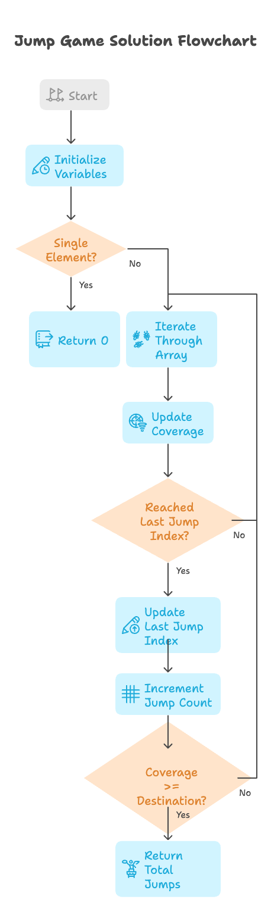

# Problem

- [55. Jump Game](https://leetcode.com/problems/jump-game-ii/description/)`Medium`

## Intuition:

The problem aims to find the minimum number of jumps required to reach the last index of a given array `nums`. Each element `nums[i]` represents the maximum jump length from index `i`.

The key intuition is to use a greedy approach:

1.  **Maximize Coverage:** At each step, we want to maximize the "coverage" (the farthest index we can reach from the current position).
2.  **Jump at Coverage Limit:** We only make a jump when we reach the limit of our current "coverage." This ensures we make the fewest jumps possible.
3.  **Update Next Jump Point:** When we jump, we update the "last jump index" to the new "coverage."
4.  **Early Termination:** If at any point our "coverage" reaches or exceeds the destination (the last index), we know we've reached the end, and we return the current jump count.

Essentially, we're trying to find the farthest reachable point at each jump, and we only jump when we absolutely have to, ensuring we minimize the total number of jumps.

```plain
Example 1:

Input: nums = [2,3,1,1,4]
Output: 2
Explanation: The minimum number of jumps to reach the last index is 2. Jump 1 step from index 0 to 1, then 3 steps to the last index.
Example 2:

Input: nums = [2,3,0,1,4]
Output: 2

```
### Algorithm :

1.  **Initialize Variables:**
    * `totalJumps` = 0 (number of jumps taken)
    * `destination` = `numsSize - 1` (index of the last element)
    * `coverage` = 0 (the farthest index reachable from the current position)
    * `lastJumpIdx` = 0 (the index from which the last jump was made)

2.  **Base Case:**
    * If `numsSize` is 1, return 0 (no jumps needed).

3.  **Iterate Through Array:**
    * For `i` from 0 to `numsSize - 1`:
        * **Update Coverage:**
            * `coverage` = maximum of `coverage` and `i + nums[i]` (calculate the farthest reachable index from `i`).
        * **Check Jump Point:**
            * If `i` is equal to `lastJumpIdx`:
                * Update `lastJumpIdx` to `coverage` (set the next jump point).
                * Increment `totalJumps` by 1.
                * **Check Destination Reach:**
                    * If `coverage` is greater than or equal to `destination`, return `totalJumps` (reached the end).

4.  **Return Total Jumps:**
    * Return `totalJumps` (after the loop completes, indicating the minimum jumps needed).




## Approaches

### Greedy Approach: 

<code>Complexity</code>

- Time complexity: O(n)


#### Solution
~~~c

#include <stdio.h>
int jump(int* nums, int numsSize) {
    int totalJumps = 0; // Jump count
    int destination = numsSize - 1; // Last index
    int coverage = 0; // Max reachable index
    int lastJumpIdx = 0; // Index of last jump

    if (numsSize == 1) return 0; // Base case: single element

    for (int i = 0; i < numsSize; i++) {
        coverage = (i + nums[i] > coverage) ? i + nums[i] : coverage; // Update max coverage

        if (i == lastJumpIdx) { // Reached last jump index
            lastJumpIdx = coverage; // Update next jump index
            totalJumps++; // Increment jump count

            if (coverage >= destination) return totalJumps; // Reached destination
        }
    }

    return totalJumps; // Return total jumps
}
int main() {
    int nums1[] = {2, 3, 1, 1, 4};
    int numsSize1 = sizeof(nums1) / sizeof(nums1[0]);
    printf("Minimum no of Jumps: %d\n", jump(nums1, numsSize1)); // Output: 2
    return 0;
}
~~~

**Dry Run: jump([2, 3, 1, 1, 4], 5)**

1.  **Initialization:**
    * `nums = [2, 3, 1, 1, 4]`
    * `numsSize = 5`
    * `totalJumps = 0`
    * `destination = 4`
    * `coverage = 0`
    * `lastJumpIdx = 0`

2.  **Iteration 1 (i = 0):**
    * `coverage = max(0, 0 + 2) = 2`
    * `i (0) == lastJumpIdx (0)`:
        * `lastJumpIdx = 2`
        * `totalJumps = 1`
        * `coverage (2) >= destination (4)` (false)

3.  **Iteration 2 (i = 1):**
    * `coverage = max(2, 1 + 3) = 4`
    * `i (1) == lastJumpIdx (2)` (false)

4.  **Iteration 3 (i = 2):**
    * `coverage = max(4, 2 + 1) = 4`
    * `i (2) == lastJumpIdx (2)`:
        * `lastJumpIdx = 4`
        * `totalJumps = 2`
        * `coverage (4) >= destination (4)` (true)
        * **Return `totalJumps` (2)**

**Conclusion:**

The algorithm correctly determines that the minimum number of jumps required to reach the last index is 2.

**Dry Run: jump([2, 3, 0, 1, 4], 5)**

1.  **Initialization:**
    * `nums = [2, 3, 0, 1, 4]`
    * `numsSize = 5`
    * `totalJumps = 0`
    * `destination = 4`
    * `coverage = 0`
    * `lastJumpIdx = 0`

2.  **Iteration 1 (i = 0):**
    * `coverage = max(0, 0 + 2) = 2`
    * `i (0) == lastJumpIdx (0)` is true.
    * `lastJumpIdx = 2`
    * `totalJumps = 1`
    * `coverage (2) >= destination (4)` is false.

3.  **Iteration 2 (i = 1):**
    * `coverage = max(2, 1 + 3) = 4`
    * `i (1) == lastJumpIdx (2)` is false.

4.  **Iteration 3 (i = 2):**
    * `coverage = max(4, 2 + 0) = 4`
    * `i (2) == lastJumpIdx (2)` is true.
    * `lastJumpIdx = 4`
    * `totalJumps = 2`
    * `coverage (4) >= destination (4)` is true.
    * Return `totalJumps (2)`.

**Conclusion:**

The algorithm correctly determines that the minimum number of jumps required to reach the end is 2.