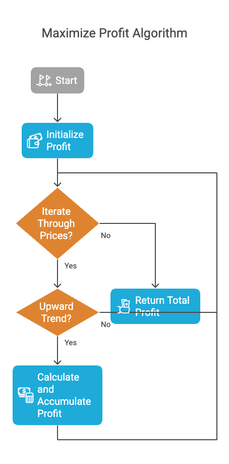
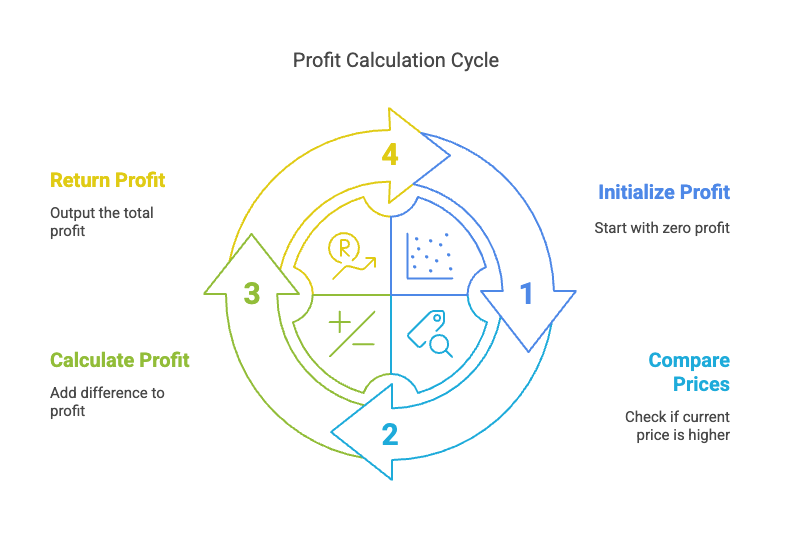

# Problem

- [122. Best Time to Buy and Sell Stock II](https://leetcode.com/problems/best-time-to-buy-and-sell-stock-ii/description/)`Medium`

## Intution
The code aims to calculate the maximum profit that can be obtained by buying and selling a stock multiple times, given an array prices where prices[i] represents the price of the stock on day i. The key insight is that we only want to buy when the price is going up, and we want to sell at the peak of each upward trend. This is done by iterating through the prices array and adding the profit of each upward trend.


```plain
Example 1:

Input: prices = [7,1,5,3,6,4]
Output: 7
Explanation: Buy on day 2 (price = 1) and sell on day 3 (price = 5), profit = 5-1 = 4.
Then buy on day 4 (price = 3) and sell on day 5 (price = 6), profit = 6-3 = 3.
Total profit is 4 + 3 = 7.
Example 2:

Input: prices = [1,2,3,4,5]
Output: 4
Explanation: Buy on day 1 (price = 1) and sell on day 5 (price = 5), profit = 5-1 = 4.
Total profit is 4.
Example 3:

Input: prices = [7,6,4,3,1]
Output: 0
Explanation: There is no way to make a positive profit, so we never buy the stock to achieve the maximum profit of 0.

```
### Algorithm :

1.  **Initialize Profit:**
    * `profit = 0`

2.  **Iterate Through Prices:**
    * For `i` from 1 to `pricesSize - 1`:
        * **Check for Upward Trend:**
            * If `prices[i] > prices[i-1]`:
                * **Calculate and Accumulate Profit:**
                    * `profit = profit + (prices[i] - prices[i-1])`

3.  **Return Total Profit:**
    * Return `profit`



## Approaches

### Array  Approach

<code>Complexity</code>

- Time complexity: O(n)
- Space complexity: O(1)



#### Solution
~~~c
#include<stdio.h>
int maxProfit(int* prices, int pricesSize) {
	int profit = 0;
	for(int i =1; i<pricesSize; i++) {
		if(prices[i]>prices[i-1])
			profit+= prices[i]-prices[i-1];
	}

	return profit;
}


int main()
{
	int prices[] = {7,1,5,3,6,4};
	int pricesSize = sizeof(prices)/sizeof(prices[0]);
	printf("%d", maxProfit(prices,pricesSize));
	return 0;
}
~~~

**Dry Run: maxProfit([7, 1, 5, 3, 6, 4], 6)**

1.  **Initialization:**
    * `prices = [7, 1, 5, 3, 6, 4]`
    * `pricesSize = 6`
    * `profit = 0`

2.  **Iteration 1 (i = 1):**
    * `prices[1] = 1`
    * `prices[0] = 7`
    * `1 < 7` (no profit)

3.  **Iteration 2 (i = 2):**
    * `prices[2] = 5`
    * `prices[1] = 1`
    * `5 > 1` (profit: 5 - 1 = 4)
    * `profit = 0 + 4 = 4`

4.  **Iteration 3 (i = 3):**
    * `prices[3] = 3`
    * `prices[2] = 5`
    * `3 < 5` (no profit)

5.  **Iteration 4 (i = 4):**
    * `prices[4] = 6`
    * `prices[3] = 3`
    * `6 > 3` (profit: 6 - 3 = 3)
    * `profit = 4 + 3 = 7`

6.  **Iteration 5 (i = 5):**
    * `prices[5] = 4`
    * `prices[4] = 6`
    * `4 < 6` (no profit)

7.  **Return:**
    * `profit = 7`

**Conclusion:**

The function correctly calculates the maximum profit as 7.

**Dry Run: maxProfit([1, 2, 3, 4, 5], 5)**

1.  **Initialization:**
    * `prices = [1, 2, 3, 4, 5]`
    * `pricesSize = 5`
    * `profit = 0`

2.  **Iteration 1 (i = 1):**
    * `prices[1] = 2`
    * `prices[0] = 1`
    * `2 > 1` (True)
    * `profit = 0 + (2 - 1) = 1`
    * `profit = 1`

3.  **Iteration 2 (i = 2):**
    * `prices[2] = 3`
    * `prices[1] = 2`
    * `3 > 2` (True)
    * `profit = 1 + (3 - 2) = 2`
    * `profit = 2`

4.  **Iteration 3 (i = 3):**
    * `prices[3] = 4`
    * `prices[2] = 3`
    * `4 > 3` (True)
    * `profit = 2 + (4 - 3) = 3`
    * `profit = 3`

5.  **Iteration 4 (i = 4):**
    * `prices[4] = 5`
    * `prices[3] = 4`
    * `5 > 4` (True)
    * `profit = 3 + (5 - 4) = 4`
    * `profit = 4`

6.  **Loop Termination:**
    * The `for` loop finishes.

7.  **Return:**
    * The function returns `profit = 4`.

**Conclusion:**

The maximum profit that can be obtained is 4.

**Dry Run: maxProfit([7, 6, 4, 3, 1], 5)**

1.  **Initialization:**
    * `prices = [7, 6, 4, 3, 1]`
    * `pricesSize = 5`
    * `profit = 0`

2.  **Iteration 1 (i = 1):**
    * `prices[1] = 6`
    * `prices[0] = 7`
    * `6 > 7` is false.
    * `profit` remains 0.

3.  **Iteration 2 (i = 2):**
    * `prices[2] = 4`
    * `prices[1] = 6`
    * `4 > 6` is false.
    * `profit` remains 0.

4.  **Iteration 3 (i = 3):**
    * `prices[3] = 3`
    * `prices[2] = 4`
    * `3 > 4` is false.
    * `profit` remains 0.

5.  **Iteration 4 (i = 4):**
    * `prices[4] = 1`
    * `prices[3] = 3`
    * `1 > 3` is false.
    * `profit` remains 0.

6.  **Loop Termination:**
    * The loop finishes.

7.  **Return:**
    * The function returns `profit`, which is 0.

**Conclusion:**

Since the prices array is in descending order, there are no upward trends, and no profit can be made. The function correctly returns 0.