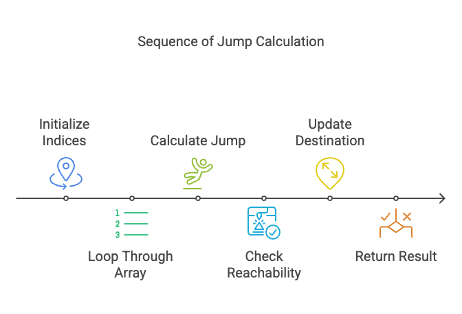

# Problem

- [55. Jump Game II](https://leetcode.com/problems/jump-game-ii/)`Medium`

## Intuition:

The problem asks if it's possible to reach the last index of an array of jump lengths, starting from the first index. Instead of trying to jump forward, which can be complex, we work backward. We iterate from the second-to-last index towards the beginning. At each index, we check if we can reach the current "destination" index (initially the last index) by jumping from the current index. If we can, we update the "destination" to the current index. If, at the end, the "destination" is the first index, it means we can reach the last index from the first index.


```plain
Example 1:

Input: nums = [2,3,1,1,4]
Output: true
Explanation: Jump 1 step from index 0 to 1, then 3 steps to the last index.
Example 2:

Input: nums = [3,2,1,0,4]
Output: false
Explanation: You will always arrive at index 3 no matter what. Its maximum jump length is 0, which makes it impossible to reach the last index.

```
### Algorithm :

1.  **Initialize Destination:**
    * Set `dest_idx` to `numsSize - 1` (the last index).
    * Set `initilize_idx` to 0 (the first index).

2.  **Iterate Backward:**
    * Loop from `i = numsSize - 2` down to 0 (second to last index to first).

3.  **Check Reachability:**
    * For each index `i`:
        * Calculate the maximum jump distance from `i`: `jump = nums[i]`.
        * If `i + jump >= dest_idx`, it means we can reach the current `dest_idx` from index `i`.
        * If the condition is true, update `dest_idx` to `i`. This means we've found a new "destination" that can reach the end.

4.  **Determine Result:**
    * After the loop, if `dest_idx` is equal to `initilize_idx` (0), it means we can reach the last index from the first index.
    * Return `true` if `dest_idx == initilize_idx`, otherwise return `false`.


## Approaches

### Greedy Approach: 

<code>Complexity</code>

- Time complexity: O(n)



#### Solution
~~~c

#include <stdio.h>
int canJump(int* nums, int numsSize) {
    int initilize_idx = 0;
    int dest_idx = numsSize -1;
    // starts with second last index
    // and move twoards initilize_idx
    for(int i = dest_idx-1; i>=0;i--){
        
        // can we reach final position
        // from current position
        int jump = nums[i];
        if(i +jump >=dest_idx )
        // move the destination to left
            dest_idx = i;
    }
    // if we can reach to initilize_idx
    // jump to dest_idx possile
    return (dest_idx==initilize_idx);
}
int main()
{
    int nums[] = {2,0};
    int numsSize = sizeof(nums)/sizeof(nums[0]);
    if(canJump(nums,numsSize))
        printf("true");
    else
         printf("false");

    return 0;
}

~~~

**Dry Run: canJump([2, 3, 1, 1, 4], 5)**

1.  **Initialization:**
    * `nums = [2, 3, 1, 1, 4]`
    * `numsSize = 5`
    * `initilize_idx = 0`
    * `dest_idx = 4`

2.  **Iteration 1 (i = 3):**
    * `nums[3] = 1`
    * `3 + 1 >= 4` (4 >= 4) - True
    * `dest_idx = 3`

3.  **Iteration 2 (i = 2):**
    * `nums[2] = 1`
    * `2 + 1 >= 3` (3 >= 3) - True
    * `dest_idx = 2`

4.  **Iteration 3 (i = 1):**
    * `nums[1] = 3`
    * `1 + 3 >= 2` (4 >= 2) - True
    * `dest_idx = 1`

5.  **Iteration 4 (i = 0):**
    * `nums[0] = 2`
    * `0 + 2 >= 1` (2 >= 1) - True
    * `dest_idx = 0`

6.  **Loop Termination:**
    * The loop finishes.

7.  **Return:**
    * `dest_idx == initilize_idx` (0 == 0) - True
    * The function returns `true`.

**Conclusion:**

The algorithm correctly determines that it's possible to reach the last index from the first index.


**Dry Run: canJump([3, 2, 1, 0, 4], 5)**

1.  **Initialization:**
    * `nums = [3, 2, 1, 0, 4]`
    * `numsSize = 5`
    * `initilize_idx = 0`
    * `dest_idx = 4`

2.  **Iteration 1 (i = 3):**
    * `nums[3] = 0`
    * `jump = 0`
    * `3 + 0 >= 4` (false)
    * `dest_idx` remains 4.

3.  **Iteration 2 (i = 2):**
    * `nums[2] = 1`
    * `jump = 1`
    * `2 + 1 >= 4` (false)
    * `dest_idx` remains 4.

4.  **Iteration 3 (i = 1):**
    * `nums[1] = 2`
    * `jump = 2`
    * `1 + 2 >= 4` (false)
    * `dest_idx` remains 4.

5.  **Iteration 4 (i = 0):**
    * `nums[0] = 3`
    * `jump = 3`
    * `0 + 3 >= 4` (false)
    * `dest_idx` remains 4.

6.  **Loop Termination:**
    * The loop finishes.

7.  **Return:**
    * `dest_idx (4) == initilize_idx (0)` (false)
    * The function returns `false`.

**Conclusion:**

As shown in the dry run, the `dest_idx` never reaches 0, indicating that it's impossible to jump from the beginning to the end. Therefore, the function correctly returns `false`.