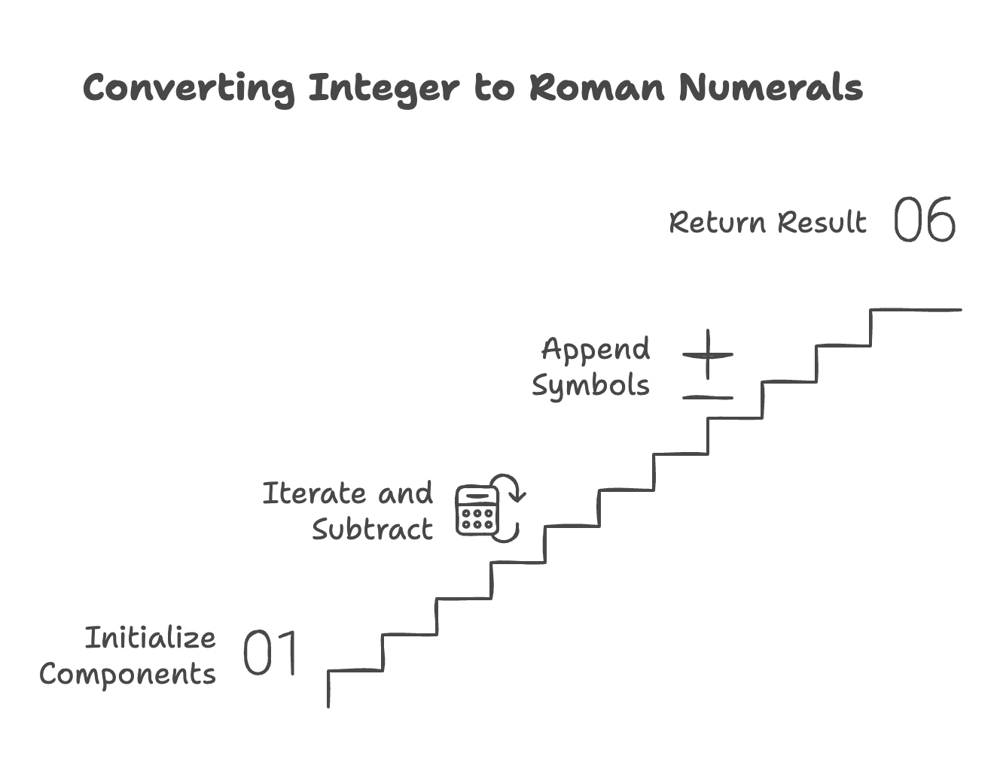
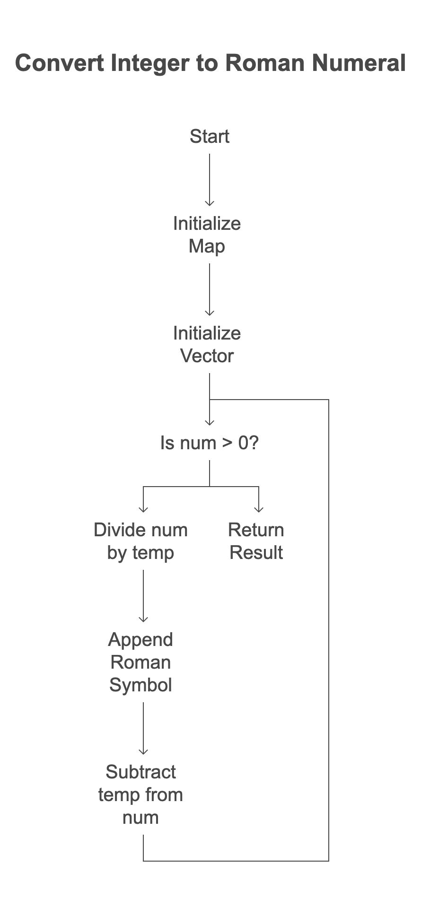

# Problem List

- [12.Roman to Integer to ](https://leetcode.com/problems/integer-to-roman/description/)`easy`

## Intution

### Inspect :
1. There are 13 possible symbol can used to make roman numarals.
   
 | Result (Roman descending order) | Result (integer) |
|-----------------|-------------------|
| M          	  | 1000              |
| CM              | 900               |
| D               | 500               |
| CD              | 400               |
| C               | 100               |
| XC              | 90                |
| L               | 50                |
| XL              | 40                |
| X               | 10                |
| IX              | 9                 |
| V               | 5                 |
| IV              | 4                 |
| I               | 1                 |

## Approaches

### Hash Table (Unordered Map) Approach
### Algorithm
1. Initializes a Roman numeral string, a value-to-symbol map, and a descending value vector.
2. Iterates through the value vector, subtracting the largest possible Roman numeral values from the input integer.
3. Appends the corresponding Roman numeral symbols to the result string.
4. Returns the final Roman numeral string.

<code>Pros:</code>
    - Optimized Lookups
<code>Cons:</code>
    - Space Overhead
  

#### Solution
~~~cpp
#include<bits/stdc++.h>
using namespace std;
class Solution {
public:
	string romanToInt(int num) {

		string s = "";
		// Create an unordered_map
		unordered_map<int, string> umap;
		// Insert key-value pairs into the unordered_map
		umap[1] = "I";
		umap[4] = "IV";
		umap[5] = "V";
		umap[9] = "IX";
		umap[10] = "X";
		umap[40] = "XL";
		umap[50] = "L";
		umap[90] = "XC";
		umap[100] = "C";
		umap[400] = "CD";
		umap[500] = "D";
		umap[900] = "CM";
		umap[1000] = "M";
		vector<int> v = {1000,900,500,400,100,90,50,40,10,9,5,4,1};

		cout<<v.size()<<endl;
		for(int i = 0; i<v.size(); i++)
		{
			int temp = v[i];
			int count = num/temp;
			while(count--)
			{
				s+=umap[temp];
				num-=temp;
			}
		}

		return s;

	}
};
int main()
{
	int num = 58; //L = 50, V= 5, III = 3, output = "LVIII"
	Solution sol;
	cout<<sol.romanToInt(num)<<endl;
	return 0;
}
~~~
