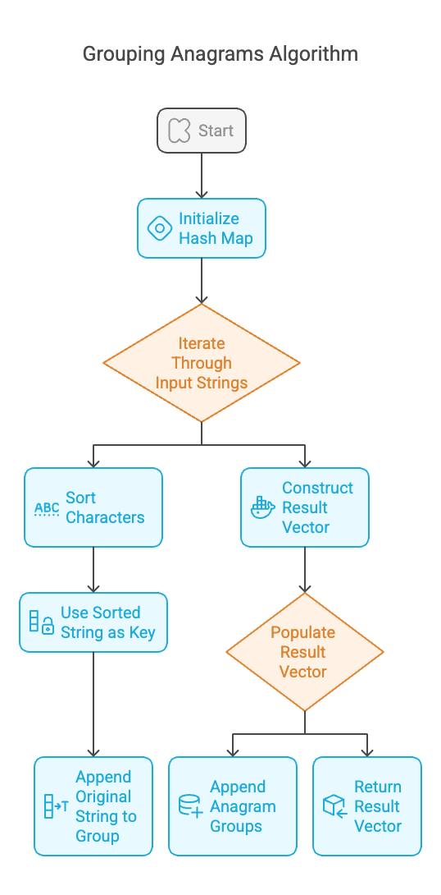
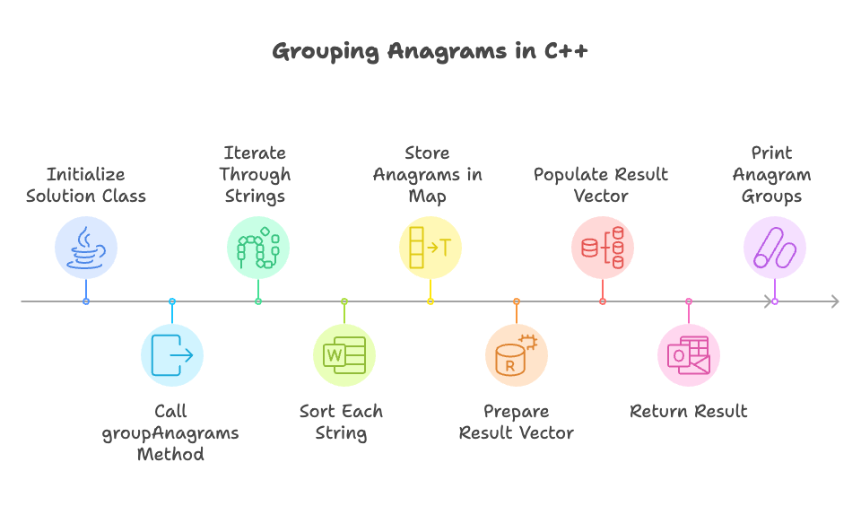

# Problem

- [122. Best Time to Buy and Sell Stock II](https://leetcode.com/problems/group-anagrams/description/)`Medium`

## Intution
The core idea is that anagrams, by definition, have the same characters but in different orders. If we sort the characters of each string, anagrams will produce identical sorted strings. We can use this sorted string as a unique identifier (key) to group anagrams together.

```plain
Example 1:

Input: strs = ["eat","tea","tan","ate","nat","bat"]

Output: [["bat"],["nat","tan"],["ate","eat","tea"]]

Explanation:

There is no string in strs that can be rearranged to form "bat".
The strings "nat" and "tan" are anagrams as they can be rearranged to form each other.
The strings "ate", "eat", and "tea" are anagrams as they can be rearranged to form each other.
Example 2:

Input: strs = [""]

Output: [[""]]

Example 3:

Input: strs = ["a"]

Output: [["a"]]
```
### Algorithm :


**Input:** A vector of strings `strs`.

**Output:** A vector of vectors of strings, where each inner vector contains a group of anagrams.

**Steps:**

1.  **Initialize a Hash Map (unordered_map):**
    * Create an `unordered_map` named `anagramGroups`.
    * The keys of this map will be sorted strings (representing the canonical form of anagrams).
    * The values will be vectors of strings (the actual anagrams).

2.  **Iterate Through Input Strings:**
    * For each string `word` in the input vector `strs`:
        * Create a copy of `word` and store it in a temporary string `temp`. This is to preserve the original word.
        * Sort the characters of `word` in ascending order.
        * Use the sorted `word` as the key in the `anagramGroups` hash map.
        * Append the original `temp` (the unsorted word) to the vector of strings associated with that key in `anagramGroups`.

3.  **Construct the Result Vector:**
    * Create a vector of vectors of strings named `result`.

4.  **Populate the Result Vector:**
    * Iterate through the `anagramGroups` hash map.
    * For each key-value pair in `anagramGroups`:
        * Append the value (which is a vector of strings representing a group of anagrams) to the `result` vector.

5.  **Return the Result:**
    * Return the `result` vector.




## Approaches

### Hash Table  Approach

<code>Pros:</code>

    - Efficiency: O(n∗klogk), where `n` is the number of strings and `k` is the maximum length of a string.



#### Solution
~~~cpp
#include<bits/stdc++.h>
using namespace std;

class Solution {
public:
    vector<vector<string>> groupAnagrams(vector<string>& strs) {
        // Map to store sorted string (key) and its anagrams (value).
        unordered_map<string, vector<string>> m;

        // Iterate through each word in the input vector.
        for (auto word : strs) {
            string temp = word; // Store the original word.
            sort(word.begin(), word.end()); // Sort the word to get its canonical form.
            m[word].push_back(temp); // Add the original word to the corresponding anagram group.
        }

        // Vector to store the result (groups of anagrams).
        vector<vector<string>> res;

        // Iterate through the map and add each group of anagrams to the result.
        for (auto it = m.begin(); it != m.end(); it++) {
            res.push_back(it->second); // Add the vector of anagrams to the result.
        }

        return res; // Return the result.
    }
};

int main() {
    Solution sol;
    vector<string> strs = {"eat", "tea", "tan", "ate", "nat", "bat"};
    vector<vector<string>> v = sol.groupAnagrams(strs); // Get the grouped anagrams.

    // Print the result correctly.
    for (const auto& group : v) {
        cout << "["; // Start of the group.
        for (size_t i = 0; i < group.size(); ++i) {
            cout << "\"" << group[i] << "\""; // Print the string with quotes.
            if (i < group.size() - 1) {
                cout << ","; // Add comma if not the last string.
            }
        }
        cout << "]" << endl; // End of the group.
    }

    return 0;
}
~~~

## Dry Run: Grouping Anagrams (Example )

**Input:** `strs = ["eat", "tea", "tan", "ate", "nat", "bat"]`

**Steps:**

1.  **Initialization:**
    * `anagramGroups = {}` (empty unordered\_map)
    * `result = []` (empty vector of vectors)

2.  **Iteration through `strs`:**

    * **"eat":**
        * `temp = "eat"`
        * `sortedWord = "aet"`
        * `anagramGroups["aet"] = ["eat"]`
    * **"tea":**
        * `temp = "tea"`
        * `sortedWord = "aet"`
        * `anagramGroups["aet"].append("tea")`
        * `anagramGroups = {"aet": ["eat", "tea"]}`
    * **"tan":**
        * `temp = "tan"`
        * `sortedWord = "ant"`
        * `anagramGroups["ant"] = ["tan"]`
        * `anagramGroups = {"aet": ["eat", "tea"], "ant": ["tan"]}`
    * **"ate":**
        * `temp = "ate"`
        * `sortedWord = "aet"`
        * `anagramGroups["aet"].append("ate")`
        * `anagramGroups = {"aet": ["eat", "tea", "ate"], "ant": ["tan"]}`
    * **"nat":**
        * `temp = "nat"`
        * `sortedWord = "ant"`
        * `anagramGroups["ant"].append("nat")`
        * `anagramGroups = {"aet": ["eat", "tea", "ate"], "ant": ["tan", "nat"]}`
    * **"bat":**
        * `temp = "bat"`
        * `sortedWord = "abt"`
        * `anagramGroups["abt"] = ["bat"]`
        * `anagramGroups = {"aet": ["eat", "tea", "ate"], "ant": ["tan", "nat"], "abt": ["bat"]}`

3.  **Constructing the `result` vector:**

    * Iterate through `anagramGroups`:
        * `"aet": ["eat", "tea", "ate"]` -> `result.append(["eat", "tea", "ate"])`
        * `"ant": ["tan", "nat"]` -> `result.append(["tan", "nat"])`
        * `"abt": ["bat"]` -> `result.append(["bat"])`
    * `result = [["eat", "tea", "ate"], ["tan", "nat"], ["bat"]]`

4.  **Returning the `result` vector:**

    * Return `result`.

**Output:** `[["eat", "tea", "ate"], ["tan", "nat"], ["bat"]]` (The order of the inner lists can vary, as the hash map does not guarantee a specific order).

## Dry Run: Grouping Anagrams (Example 2)

**Input:** `strs = [""]`

**Initialization:**

* `anagramGroups = {}` (empty unordered map)
* `result = []` (empty vector of vectors)

**Iteration:**

1.  **Iterate through "":**
    * `word = ""`
    * `temp = ""` (copy of word)
    * `sortedWord = ""` (sorting an empty string yields an empty string)
    * `anagramGroups[""] = [""]`

**Construct Result:**

1.  **Iterate through `anagramGroups`:**
    * `anagramGroups` contains the key-value pair `"": [""]`.
    * Append `[""]` to `result`.
    * `result = [[""]]`

**Return Result:**

* Return `result = [[""]]`

**Output:** `[[""]]`

## Dry Run: Grouping Anagrams (Example 3)

**Input:** `strs = ["a"]`

**Steps:**

1.  **Initialization:**
    * `anagramGroups = {}` (empty unordered\_map)
    * `result = []` (empty vector of vectors)

2.  **Iteration:**

    * **"a":**
        * `temp = "a"`
        * `sortedWord = "a"` (sorting "a" results in "a")
        * `anagramGroups["a"] = ["a"]`

3.  **Construct Result:**

    * Iterate through `anagramGroups`:
        * `"a": ["a"]` -> `result.append(["a"])`
    * `result = [["a"]]`

4.  **Return Result:**

    * Return `result = [["a"]]`

**Output:** `[["a"]]`