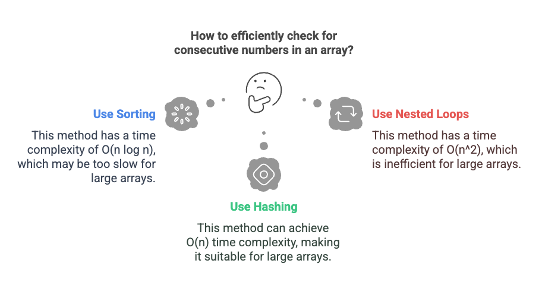
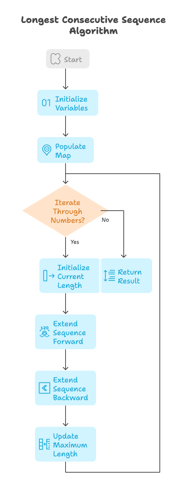

# Problem

- [128. Longest Consecutive Sequence](https://leetcode.com/problems/longest-consecutive-sequence/)`Medium`

## Intution
The key is to efficiently check for the presence of consecutive numbers. We can't afford to sort the array (which would take O(nlogn) time) or use nested loops that would lead to O(n^2)time complexity.

```plain
Example 1:

Input: nums = [100,4,200,1,3,2]
Output: 4
Explanation: The longest consecutive elements sequence is [1, 2, 3, 4]. Therefore its length is 4.
Example 2:

Input: nums = [0,3,7,2,5,8,4,6,0,1]
Output: 9
Example 3:

Input: nums = [1,0,1,2]
Output: 3

```
### Algorithm :



**Input:** An unsorted array of integers `nums`.

**Output:** The length of the longest consecutive elements sequence.

**Steps:**

1.  **Initialize Variables:**
    * `length` = 0 (Initialize the maximum consecutive sequence length to 0).
    * `m` = an empty unordered map (Hash map) where keys are integers from `nums` and values are booleans.

2.  **Populate the Unordered Map:**
    * For each `number` in `nums`:
        * Set `m[number]` = `false` (Mark all numbers as unvisited initially).

3.  **Iterate Through Numbers:**
    * For each `n` in `nums`:
        * `current_length` = 1 (Initialize the length of the current consecutive sequence to 1, as `n` is part of it).
        * `next_number` = `n + 1`
        * `previous_number` = `n - 1`

4.  **Extend Sequence Forward:**
    * While `next_number` exists as a key in `m` AND `m[next_number]` is `false`:
        * Increment `current_length` by 1.
        * Set `m[next_number]` = `true` (Mark `next_number` as visited).
        * Increment `next_number` by 1.

5.  **Extend Sequence Backward:**
    * While `previous_number` exists as a key in `m` AND `m[previous_number]` is `false`:
        * Increment `current_length` by 1.
        * Set `m[previous_number]` = `true` (Mark `previous_number` as visited).
        * Decrement `previous_number` by 1.

6.  **Update Maximum Length:**
    * `length` = maximum of `length` and `current_length`.

7.  **Return Result:**
    * Return `length`.


## Approach



### Hash Table  Approach

<code>Pros:</code>

    - Efficiency: O(n), where `n` is the number of elements


#### Solution
```cpp
#include <bits/stdc++.h>
using namespace std;

class Solution {
public:
    int longestConsecutive(vector<int>& nums) {
        // Initialize the length of the longest consecutive sequence found so far.
        int length = 0;
        // Variable to store the length of the current consecutive sequence.
        int cur_len;
        // An unordered map to store the presence of each number in the input vector.
        // The boolean value indicates whether the number has been visited/processed.
        unordered_map<int, bool> m;

        // Populate the unordered map with all numbers from the input vector.
        // Initially, all numbers are marked as not visited (false).
        // Time complexity: O(n), where n is the size of nums.
        for (int i = 0; i < nums.size(); i++) {
            m[nums[i]] = false;
        }

        // Iterate through each number in the input vector.
        // Time complexity of this outer loop is O(n).
        for (auto n : nums) {
            // Initialize the length of the current consecutive sequence to 1 (the number itself).
            cur_len = 1;
            // Variable to track the next number in the potential consecutive sequence.
            int nextNum = n + 1;

            // Check for consecutive numbers greater than the current number.
            // Time complexity of m.find() is O(1) on average.
            // Time complexity of accessing m[nextNum] is O(1) on average.
            // The while loop's total iterations across all numbers is bounded by O(n).
            while ((!(m.find(nextNum) == m.end())) && m[nextNum] == false) {
                // Increment the length of the current consecutive sequence.
                cur_len++;
                // Mark the current number as visited.
                m[nextNum] = true;
                // Move to the next number in the potential sequence.
                nextNum++;
            }

            // Variable to track the previous number in the potential consecutive sequence.
            int prevNum = n - 1;

            // Check for consecutive numbers smaller than the current number.
            // Time complexity of m.find() is O(1) on average.
            // Time complexity of accessing m[prevNum] is O(1) on average.
            // The while loop's total iterations across all numbers is bounded by O(n).
            while ((!(m.find(prevNum) == m.end())) && m[prevNum] == false) {
                // Increment the length of the current consecutive sequence.
                cur_len++;
                // Mark the current number as visited.
                m[prevNum] = true;
                // Move to the previous number in the potential sequence.
                prevNum--;
            }

            // Update the maximum length found so far.
            length = (cur_len > length) ? cur_len : length;
        }

        // Return the length of the longest consecutive sequence.
        return length;
    }
};

int main() {
    Solution sol;
    // Example input vector.
    vector<int> nums = {100, 4, 200, 1, 3, 2};
    // Calculate the length of the longest consecutive sequence.
    int len = sol.longestConsecutive(nums);

    // Output the result.
    cout << len << endl;
    return 0;
}
```

# Dry Run: Longest Consecutive Sequence - Example 1

**Input:** `nums = [100, 4, 200, 1, 3, 2]`

**Steps:**

1.  **Initialization:**
    * `length = 0`
    * `m = {}` (empty unordered map)

2.  **Populate `m`:**
    * `m[100] = false`
    * `m[4] = false`
    * `m[200] = false`
    * `m[1] = false`
    * `m[3] = false`
    * `m[2] = false`
    * Now, `m = {100: false, 4: false, 200: false, 1: false, 3: false, 2: false}`

3.  **Iterate through `nums`:**

    * **`n = 100`:**
        * `current_length = 1`
        * `next_number = 101`, `previous_number = 99`
        * `101` and `99` are not in `m`.
        * `length = max(0, 1) = 1`

    * **`n = 4`:**
        * `current_length = 1`
        * `next_number = 5`, `previous_number = 3`
        * `5` is not in `m`, but `3` is.
        * `previous_number = 3`, `m[3] = false`
        * `current_length = 2`, `m[3] = true`, `previous_number = 2`
        * `previous_number = 2`, `m[2] = false`
        * `current_length = 3`, `m[2] = true`, `previous_number = 1`
        * `previous_number = 1`, `m[1] = false`
        * `current_length = 4`, `m[1] = true`, `previous_number = 0`
        * `0` is not in `m`
        * `length = max(1, 4) = 4`

    * **`n = 200`:**
        * `current_length = 1`
        * `next_number = 201`, `previous_number = 199`
        * `201` and `199` are not in `m`.
        * `length = max(4, 1) = 4`

    * **`n = 1`:**
        * `current_length = 1`
        * `next_number = 2`, `previous_number = 0`
        * `m[2] = true` (already visited)
        * `0` is not in `m`
        * `length = max(4, 1) = 4`

    * **`n = 3`:**
        * `current_length = 1`
        * `next_number = 4`, `previous_number = 2`
        * `m[4] = true` (already visited)
        * `m[2] = true` (already visited)
        * `length = max(4, 1) = 4`

    * **`n = 2`:**
        * `current_length = 1`
        * `next_number = 3`, `previous_number = 1`
        * `m[3] = true` (already visited)
        * `m[1] = true` (already visited)
        * `length = max(4, 1) = 4`

4.  **Return `length`:**
    * Return `4`

**Result:** The longest consecutive sequence is `[1, 2, 3, 4]`, and its length is `4`.

# Dry Run: Longest Consecutive Sequence - Example 2:

**Input:** `nums = [0, 3, 7, 2, 5, 8, 4, 6, 0, 1]`

**Initial State:**

* `length = 0`
* `m = {}` (empty unordered map)

**1. Populate the Unordered Map (m):**

* `m[0] = false`
* `m[3] = false`
* `m[7] = false`
* `m[2] = false`
* `m[5] = false`
* `m[8] = false`
* `m[4] = false`
* `m[6] = false`
* `m[0] = false` (duplicate, no change)
* `m[1] = false`

    * `m = {0: false, 1: false, 2: false, 3: false, 4: false, 5: false, 6: false, 7: false, 8: false}`

**2. Iterate Through `nums`:**

* **n = 0:**
    * `current_length = 1`
    * `next_number = 1`
    * `previous_number = -1`
    * **Forward Extension:**
        * `next_number` (1) is in `m` and `m[1]` is `false`.
            * `current_length = 2`
            * `m[1] = true`
            * `next_number = 2`
        * `next_number` (2) is in `m` and `m[2]` is `false`.
            * `current_length = 3`
            * `m[2] = true`
            * `next_number = 3`
        * `next_number` (3) is in `m` and `m[3]` is `false`.
            * `current_length = 4`
            * `m[3] = true`
            * `next_number = 4`
        * `next_number` (4) is in `m` and `m[4]` is `false`.
            * `current_length = 5`
            * `m[4] = true`
            * `next_number = 5`
        * `next_number` (5) is in `m` and `m[5]` is `false`.
            * `current_length = 6`
            * `m[5] = true`
            * `next_number = 6`
        * `next_number` (6) is in `m` and `m[6]` is `false`.
            * `current_length = 7`
            * `m[6] = true`
            * `next_number = 7`
        * `next_number` (7) is in `m` and `m[7]` is `false`.
            * `current_length = 8`
            * `m[7] = true`
            * `next_number = 8`
        * `next_number` (8) is in `m` and `m[8]` is `false`.
            * `current_length = 9`
            * `m[8] = true`
            * `next_number = 9`
        * `next_number` (9) is not in `m`.
    * **Backward Extension:**
        * `previous_number` (-1) is not in `m`.
    * `length = max(0, 9) = 9`

* **n = 3, 7, 2, 5, 8, 4, 6, 0, 1:**
    * Because the related numbers have already been marked as `true` in `m` during the first iteration (n=0) the loops will not run, and the length will not change.

**Final Result:**

* `length = 9`

**Output:** `9`