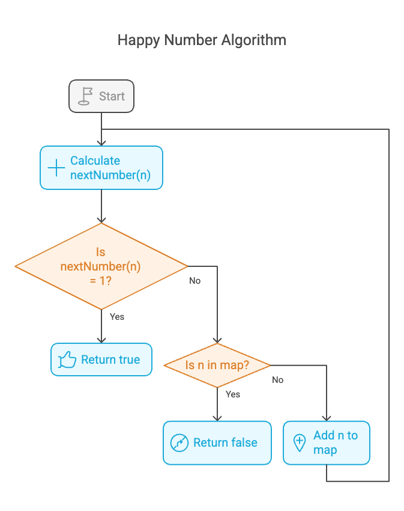
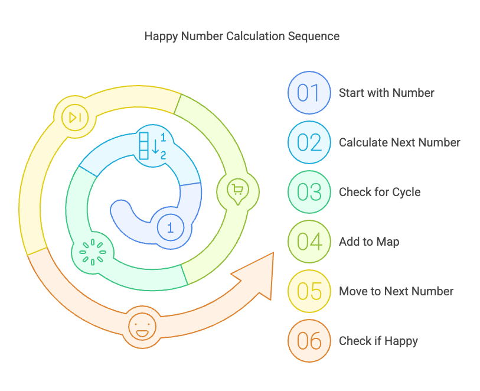

# Problem

- [202. Happy Number](https://leetcode.com/problems/happy-number/description/)`easy`

## Intution
The core idea is to simulate the process of repeatedly replacing a number with the sum of the squares of its digits. If this process eventually leads to 1, the number is considered "happy." However, if the process enters a cycle (repeats a number), it's not a happy number. To detect cycles, we use a hash set (or in this case, an unordered map) to keep track of the numbers we've already encountered

```plain
Example 1:

Input: n = 19
Output: true
Explanation:
12 + 92 = 82
82 + 22 = 68
62 + 82 = 100
12 + 02 + 02 = 1
Example 2:

Input: n = 2
Output: false
```
### Algorithm :

1. nextNumber(n) Function:

    Calculate the sum of the squares of the digits of n.
    Return the calculated sum.

2. isHappy(n) Function:

    - Initialize an empty unordered map m to store encountered numbers.
    - Calculate the next number in the sequence using nextNumber(n).
    - While the next number is not 1:
      1. Check if the current number n is already in the map.
         - If it is, a cycle has been detected, so return `false`.
         - If it is not, store the current number into the map.
      2.  Update n to the next number.
      3. calculate the next number.
    - If the loop finishes, return `true`.



## Approaches

### Hash Table  Approach

<code>Pros:</code>

    - Efficiency:* The O(log n)
    - Optimized Lookups



#### Solution
~~~c
#include <stdio.h>
#include <string.h>
#define SIZE 26 // lowercase English letters.
int canConstruct(char *ransomNote, char *magazine)
{

    int len_ransome = strlen(ransomNote);
    int len_magazine = strlen(magazine);
    int a[SIZE] = {};

    // increment the value of each char index
    for (int i = 0; i < len_ransome; i++)
        a[ransomNote[i] - 'a']++;

    // deccrement the value of each char index
    for (int i = 0; i < len_magazine; i++)
    {
        a[magazine[i] - 'a']--;
    }

    for (int i = 0; i < SIZE; i++)
        if (a[i] > 0)
            return 0;

    return 1;
}

int main()
{

    char ransomNote[] = "a", magazine[] = "b";
    int res = canConstruct(ransomNote, magazine);
    printf("%d", res);
    return 0;
}
~~~


**Dry Run e,g: isHappy(19)**

1.  **Initialization:**
    * `n = 19`
    * `m = {}` (empty unordered map)

2.  **First Iteration:**
    * `next_num = nextNumber(19)`
    * `next_num = 1^2 + 9^2 = 1 + 81 = 82`
    * `m = {19: 82}`
    * `n = 82`

3.  **Second Iteration:**
    * `next_num = nextNumber(82)`
    * `next_num = 8^2 + 2^2 = 64 + 4 = 68`
    * `m = {19: 82, 82: 68}`
    * `n = 68`

4.  **Third Iteration:**
    * `next_num = nextNumber(68)`
    * `next_num = 6^2 + 8^2 = 36 + 64 = 100`
    * `m = {19: 82, 82: 68, 68: 100}`
    * `n = 100`

5.  **Fourth Iteration:**
    * `next_num = nextNumber(100)`
    * `next_num = 1^2 + 0^2 + 0^2 = 1`
    * `m = {19: 82, 82: 68, 68: 100, 100: 1}`
    * `n = 1`

6.  **Loop Termination:**
    * `next_num == 1`
    * The `while` loop terminates.

7.  **Return:**
    * The function returns `true`.

**Conclusion:**

The number 19 is a happy number.

**Dry Run e,g: isHappy(2)**

1.  **Initialization:**
    * `n` = 2
    * `m` = {} (empty unordered map)

2.  **First Iteration:**
    * `next_num` = `nextNumber(2)`
    * `next_num` = 2\*2 = 4
    * `next_num` = 4
    * `next_num` != 1, so continue.
    * `m` = {2: 4}
    * `n` = 4

3.  **Second Iteration:**
    * `next_num` = `nextNumber(4)`
    * `next_num` = 4\*4 = 16
    * `next_num` = 16
    * `next_num` != 1, so continue.
    * `m` = {2: 4, 4: 16}
    * `n` = 16

4.  **Third Iteration:**
    * `next_num` = `nextNumber(16)`
    * `next_num` = 1\*1 + 6\*6 = 1 + 36 = 37
    * `next_num` = 37
    * `next_num` != 1, so continue.
    * `m` = {2: 4, 4: 16, 16: 37}
    * `n` = 37

5.  **Fourth Iteration:**
    * `next_num` = `nextNumber(37)`
    * `next_num` = 3\*3 + 7\*7 = 9 + 49 = 58
    * `next_num` = 58
    * `next_num` != 1, so continue.
    * `m` = {2: 4, 4: 16, 16: 37, 37: 58}
    * `n` = 58

6.  **Fifth Iteration:**
    * `next_num` = `nextNumber(58)`
    * `next_num` = 5\*5 + 8\*8 = 25 + 64 = 89
    * `next_num` = 89
    * `next_num` != 1, so continue.
    * `m` = {2: 4, 4: 16, 16: 37, 37: 58, 58: 89}
    * `n` = 89

7.  **Sixth Iteration:**
    * `next_num` = `nextNumber(89)`
    * `next_num` = 8\*8 + 9\*9 = 64 + 81 = 145
    * `next_num` = 145
    * `next_num` != 1, so continue.
    * `m` = {2: 4, 4: 16, 16: 37, 37: 58, 58: 89, 89: 145}
    * `n` = 145

8.  **Seventh Iteration:**
    * `next_num` = `nextNumber(145)`
    * `next_num` = 1\*1 + 4\*4 + 5\*5 = 1 + 16 + 25 = 42
    * `next_num` = 42
    * `next_num` != 1, so continue.
    * `m` = {2: 4, 4: 16, 16: 37, 37: 58, 58: 89, 89: 145, 145: 42}
    * `n` = 42

9.  **Eighth Iteration:**
    * `next_num` = `nextNumber(42)`
    * `next_num` = 4\*4 + 2\*2 = 16 + 4 = 20
    * `next_num` = 20
    * `next_num` != 1, so continue.
    * `m` = {2: 4, 4: 16, 16: 37, 37: 58, 58: 89, 89: 145, 145: 42, 42:20}
    * `n` = 20

10. **Ninth Iteration:**
    * `next_num` = `nextNumber(20)`
    * `next_num` = 2\*2 + 0\*0 = 4 + 0 = 4
    * `next_num` = 4
    * `next_num` != 1, so continue.
    * `m` = {2: 4, 4: 16, 16: 37, 37: 58, 58: 89, 89: 145, 145: 42, 42:20, 20:4}
    * `n` = 4

11. **Tenth Iteration:**
    * `n` = 4, and 4 is already in map m. Therefore a cycle is detected, and the function returns false.

**Output: false**
