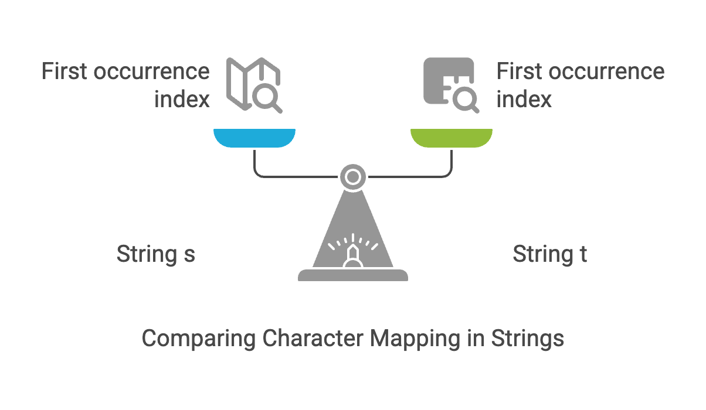

# Problem 

  - [205. Isomorphic Strings](https://leetcode.com/problems/isomorphic-strings/?envType=study-plan-v2&envId=top-interview-150)`easy`
  
## Intution
The essence of the solution lies in ensuring that a consistent mapping exists between characters in s and t. In other words, if a character x in s maps to y in t, then every occurrence of x must map to y, and no other character in s should map to y.

~~~~
Example 1:

Input: s = "egg", t = "add"

Output: true

Explanation:

The strings s and t can be made identical by:

Mapping 'e' to 'a'.
Mapping 'g' to 'd'.
Example 2:

Input: s = "foo", t = "bar"

Output: false

Explanation:

The strings s and t can not be made identical as 'o' needs to be mapped to both 'a' and 'r'.

Example 3:

Input: s = "paper", t = "title"

Output: true
~~~~

## Approaches

### Hash Table  Approach

<code>Pros:</code>
    - Efficiency:* The O(m+n) 
    - Optimized Lookups O( SIZE)
  
### Algorithm 
* **Goal:** Determine if there's a one-to-one mapping between characters in `s1` and `s2`.
  
    * Use two hash maps, `m1` and `m2`, to store the first occurrence index of characters in `s1` and `s2`, respectively.
    * **Length Check:** If `s1` and `s2` have different lengths, they cannot be isomorphic, so return `false`.
    * **Iteration:** Iterate through the strings, character by character.
        * **First Occurrence:** If a character is encountered for the first time in either string, store its index in the corresponding hash map (`m1` for `s1`, `m2` for `s2`).
        * **Index Comparison:** For each pair of characters at the same index in `s1` and `s2`, check if their first occurrence indices (stored in `m1` and `m2`) are the same.
        * **Mismatch:** If the indices don't match, the strings are not isomorphic, so return `false`.
    * **Isomorphic:** If the loop completes without finding any mismatches, the strings are isomorphic, so return `true`.
  

#### Solution
~~~cpp
#include <bits/stdc++.h>
using namespace std;
#define SIZE 256 // SIZE is maximum number of different characters in the two strings
bool isIsomorphic(string s, string t)
{

    if (s.length() != t.length())
        return false;

    unordered_map<char, int> m1, m2;

    for (int i = 0; i < s.length(); ++i)
    {

        // If character not seen before,
        if (m1.find(s[i]) == m1.end())
        {
            // store its  first occurrence index
            m1[s[i]] = i;

            // m1 hash table
            // 'a' : 0
            // b : 2
        }

        // If character not seen before,
        if (m2.find(t[i]) == m2.end())
        {
            // store its  first occurrence index
            m2[t[i]] = i;

            // m2 hash table
            // 'x' : 0
            // y : 2
        }

        // Check if the first occurrence indices match
        if (m1[s[i]] != m2[t[i]])
        {
            return false;
        }
    }
    return true;
}
int main()
{
    string s = "aab", t = "xxy";

    cout << isIsomorphic(s, t);

    return 0;
}

~~~

