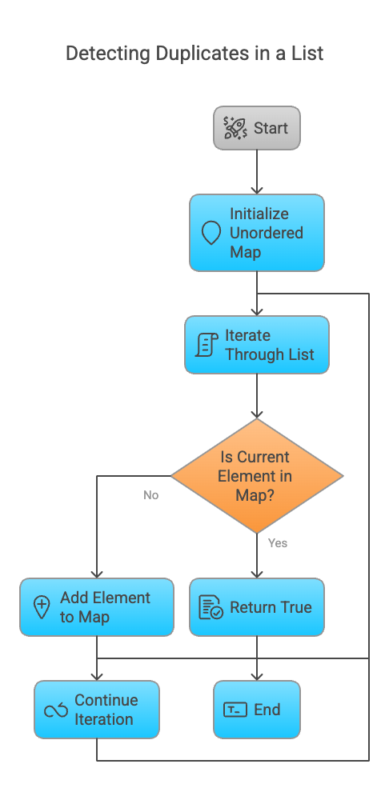

# Problem

- [217. Contains Duplicate](https://leetcode.com/problems/contains-duplicate/description/)`easy`

## Intution
he code's purpose is to detect if there are any duplicate numbers within a given vector (nums). It leverages a hash map (unordered_map) to efficiently keep track of the numbers it has encountered so far. The idea is that if a number is seen again, it must be a duplicate.


```plain
Example 1:

Input: nums = [1,2,3,1]

Output: true

Explanation:

The element 1 occurs at the indices 0 and 3.

Example 2:

Input: nums = [1,2,3,4]

Output: false

Explanation:

All elements are distinct.

Example 3:

Input: nums = [1,1,1,3,3,4,3,2,4,2]

Output: true
```
### Algorithm :

1. Initialize a Hash Map:
   - Create an empty hash map (`m`) to store the numbers encountered.
2. Iterate Through the Vector:
   - Loop through each element (`nums[i]`) in the input vector `nums`.
3. Check for Duplicates:
   - For each element, check if it already exists as a value in the hash map.
    1. If the element is not in the hash map, add it to the map (using the value as a key and the insex as the value).
    2. If the element is already in the hash map, it means a duplicate has been found, so return `true`.
4. No Duplicates Found:
   - If the loop completes without finding any duplicates, return `false`.



## Approaches

### Hash Table  Approach

<code>Pros:</code>

    - Efficiency:* The O(N)
    - Optimized Lookups


#### Solution
~~~c
#include<bits/stdc++.h>
using namespace std;

class Solution {
public:
	bool containsDuplicate(vector<int>& nums) {
		// Declare an unordered map to store encountered numbers.
		unordered_map<int, int> m;
		// Iterate through the input vector 'nums'.
		for (int i = 0; i < nums.size(); i++) {
			// Check if the current element 'nums[i]' is already present in the map 'm'.
			if (m.find(nums[i]) == m.end()) {
				// If 'nums[i]' is not found in the map, it means we haven't encountered it yet.
				// Store the current value nums[i] as the key and 'i' as the key in the map.
				m[nums[i]] = i;
			} else {
				// If 'nums[i]' is found in the map, it means we've encountered it before.
				// This indicates a duplicate element, so return true.
				return true;
			}
		}
// If the loop completes without finding any duplicates, return false.
		return false;
	}
};
int main()
{
	Solution sol;
	vector<int> nums= {1,2,3,1};
	cout<<sol.containsDuplicate(nums)<<endl;


	return 0;
}
~~~

**Dry Run: containsDuplicate([1, 2, 3, 1])**

1.  **Initialization:**
    * `nums = [1, 2, 3, 1]`
    * `m = {}` (empty unordered map)

2.  **Iteration 1 (i = 0):**
    * `nums[0] = 1`
    * `m.find(1)` returns `m.end()` (1 is not in `m`).
    * `m[1] = 0`
    * `m = {1: 0}`

3.  **Iteration 2 (i = 1):**
    * `nums[1] = 2`
    * `m.find(2)` returns `m.end()` (2 is not in `m`).
    * `m[2] = 1`
    * `m = {1: 0, 2: 1}`

4.  **Iteration 3 (i = 2):**
    * `nums[2] = 3`
    * `m.find(3)` returns `m.end()` (3 is not in `m`).
    * `m[3] = 2`
    * `m = {1: 0, 2: 1, 3: 2}`

5.  **Iteration 4 (i = 3):**
    * `nums[3] = 1`
    * `m.find(1)` does *not* return `m.end()` (1 is in `m`).
    * The `else` block is executed.
    * The function returns `true`.

**Conclusion:**

The function correctly identifies that the input array `[1, 2, 3, 1]` contains a duplicate (the number 1), and returns `true`.

**Dry Run: containsDuplicate([1, 2, 3, 4])**

1.  **Initialization:**
    * `nums = [1, 2, 3, 4]`
    * `m = {}` (empty unordered map)

2.  **Iteration 1 (i = 0):**
    * `nums[0] = 1`
    * `m.find(1)` returns `m.end()` (1 is not in `m`).
    * `m[1] = 0`
    * `m = {1: 0}`

3.  **Iteration 2 (i = 1):**
    * `nums[1] = 2`
    * `m.find(2)` returns `m.end()` (2 is not in `m`).
    * `m[2] = 1`
    * `m = {1: 0, 2: 1}`

4.  **Iteration 3 (i = 2):**
    * `nums[2] = 3`
    * `m.find(3)` returns `m.end()` (3 is not in `m`).
    * `m[3] = 2`
    * `m = {1: 0, 2: 1, 3: 2}`

5.  **Iteration 4 (i = 3):**
    * `nums[3] = 4`
    * `m.find(4)` returns `m.end()` (4 is not in `m`).
    * `m[4] = 3`
    * `m = {1: 0, 2: 1, 3: 2, 4: 3}`

6.  **Loop Termination:**
    * The `for` loop finishes.

7.  **Return:**
    * The function returns `false`.

**Conclusion:**

Since no duplicates were found, the function correctly returns `false`.