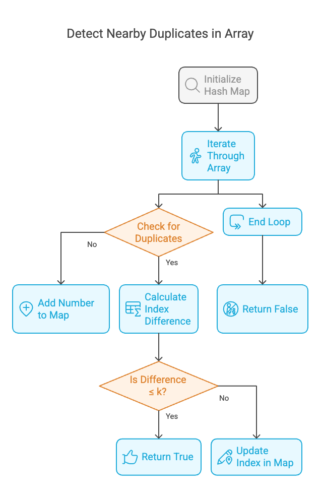
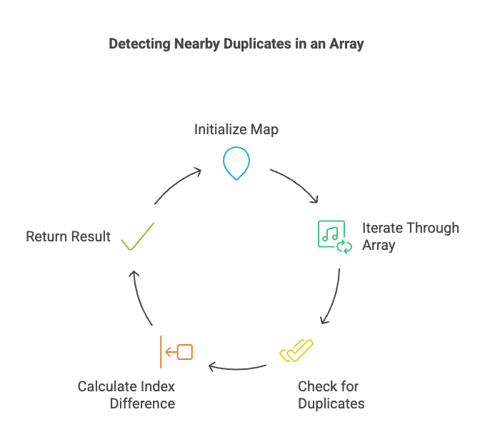

# Problem

- [219. Contains Duplicate II](https://leetcode.com/problems/contains-duplicate-ii/description/)`easy`

## Intution
The core idea is to find if there are any duplicate numbers within a specified distance k in the given array nums. We use a hash map (unordered_map) to efficiently track the indices of the numbers we've encountered. The hash map allows us to quickly check if a number has appeared before and, if so, calculate the distance between its current and previous occurrences.


```plain
Example 1:

Input: nums = [1,2,3,1], k = 3
Output: true
Example 2:

Input: nums = [1,0,1,1], k = 1
Output: true
Example 3:

Input: nums = [1,2,3,1,2,3], k = 2
Output: false

```
### Algorithm :
**Algorithm: containsNearbyDuplicate(nums, k)**

1.  **Initialize Hash Map:**
    * Create an empty `unordered_map` called `m` to store number-index pairs.

2.  **Iterate Through Array:**
    * For each index `i` from 0 to `nums.size() - 1`:
        * **Check for Duplicate:**
            * If `nums[i]` is found in `m`:
                * Calculate `distance = i - m[nums[i]]`.
                * If `distance <= k`:
                    * Return `true` (nearby duplicate found).
                * Else:
                    * Update `m[nums[i]] = i` (store the most recent index).
            * Else:
                * Store `m[nums[i]] = i` (add number-index pair to map).

3.  **No Nearby Duplicates:**
    * If the loop completes without returning `true`, return `false`.



## Approaches

### Hash Table  Approach

<code>Pros:</code>

    - Efficiency:* The O(N)
    - Optimized Lookups



#### Solution
~~~c
#include<bits/stdc++.h>
using namespace std;

class Solution {
public:
	bool containsNearbyDuplicate(vector<int>& nums, int k) {
		// Declare an unordered map
		unordered_map<int, int> m;
		// Iterate through the input vector 'nums'.
		for (int i = 0; i < nums.size(); i++) {
			// Check if the current element 'nums[i]' is not in the map.
			if (m.find(nums[i]) == m.end()) {
				// Store the element and its index in the map.
				m[nums[i]] = i;
			} else {
				// If the element 'nums[i]' is already in the map (duplicate found).
				//Check if the difference between the current index 'i' and
				//the previously stored index is less than or equal to 'k'.
				if (i - m[nums[i]] <= k) {
					// If the difference is within 'k', return true (nearby duplicate found).
					return true;
				}
				// Update the index of 'nums[i]' to the current index 'i'.
				//This ensures we're always looking for the closest duplicate.
				m[nums[i]] = i;
			}
		}
		// If the loop completes without finding nearby duplicates, return false.
		return false;
	}
};
int main()
{
	Solution sol;
	vector<int> nums= {1,2,3,1,2,3};
	int k= 2;
	cout<<sol.containsNearbyDuplicate(nums,k)<<endl;


	return 0;
}
~~~

**Dry Run: containsNearbyDuplicate([1, 2, 3, 1], 3)**

1.  **Initialization:**
    * `nums = [1, 2, 3, 1]`
    * `k = 3`
    * `m = {}` (empty unordered map)

2.  **Iteration 1 (i = 0):**
    * `nums[0] = 1`
    * `m.find(1)` returns `m.end()` (1 is not in `m`).
    * `m[1] = 0`
    * `m = {1: 0}`

3.  **Iteration 2 (i = 1):**
    * `nums[1] = 2`
    * `m.find(2)` returns `m.end()` (2 is not in `m`).
    * `m[2] = 1`
    * `m = {1: 0, 2: 1}`

4.  **Iteration 3 (i = 2):**
    * `nums[2] = 3`
    * `m.find(3)` returns `m.end()` (3 is not in `m`).
    * `m[3] = 2`
    * `m = {1: 0, 2: 1, 3: 2}`

5.  **Iteration 4 (i = 3):**
    * `nums[3] = 1`
    * `m.find(1)` does *not* return `m.end()` (1 is in `m`).
    * `distance = 3 - m[1] = 3 - 0 = 3`
    * `distance (3) <= k (3)` is `true`.
    * Return `true`.

**Conclusion:**

The function correctly returns `true` because the duplicate `1`s are within a distance of `k = 3`.

**Dry Run: containsNearbyDuplicate([1, 0, 1, 1], 1)**

1.  **Initialization:**
    * `nums = [1, 0, 1, 1]`
    * `k = 1`
    * `m = {}` (empty unordered map)

2.  **Iteration 1 (i = 0):**
    * `nums[0] = 1`
    * `m.find(1)` returns `m.end()`
    * `m[1] = 0`
    * `m = {1: 0}`

3.  **Iteration 2 (i = 1):**
    * `nums[1] = 0`
    * `m.find(0)` returns `m.end()`
    * `m[0] = 1`
    * `m = {1: 0, 0: 1}`

4.  **Iteration 3 (i = 2):**
    * `nums[2] = 1`
    * `m.find(1)` does *not* return `m.end()`
    * `distance = 2 - m[1] = 2 - 0 = 2`
    * `2 > k (1)`
    * `m[1] = 2`
    * `m = {1: 2, 0: 1}`

5.  **Iteration 4 (i = 3):**
    * `nums[3] = 1`
    * `m.find(1)` does *not* return `m.end()`
    * `distance = 3 - m[1] = 3 - 2 = 1`
    * `1 <= k (1)`
    * Return `true`

**Conclusion:**

The function returns `true` because there are two occurrences of the number `1` with a distance of `1`, which is less than or equal to `k`.

**Dry Run: containsNearbyDuplicate([1, 2, 3, 1, 2, 3], 2)**

1.  **Initialization:**
    * `nums = [1, 2, 3, 1, 2, 3]`
    * `k = 2`
    * `m = {}` (empty unordered map)

2.  **Iteration 1 (i = 0):**
    * `nums[0] = 1`
    * `m.find(1)` returns `m.end()`
    * `m[1] = 0`
    * `m = {1: 0}`

3.  **Iteration 2 (i = 1):**
    * `nums[1] = 2`
    * `m.find(2)` returns `m.end()`
    * `m[2] = 1`
    * `m = {1: 0, 2: 1}`

4.  **Iteration 3 (i = 2):**
    * `nums[2] = 3`
    * `m.find(3)` returns `m.end()`
    * `m[3] = 2`
    * `m = {1: 0, 2: 1, 3: 2}`

5.  **Iteration 4 (i = 3):**
    * `nums[3] = 1`
    * `m.find(1)` does not return `m.end()`
    * `distance = 3 - m[1] = 3 - 0 = 3`
    * `3 > 2` (3 > k)
    * `m[1] = 3`
    * `m = {1: 3, 2: 1, 3: 2}`

6.  **Iteration 5 (i = 4):**
    * `nums[4] = 2`
    * `m.find(2)` does not return `m.end()`
    * `distance = 4 - m[2] = 4 - 1 = 3`
    * `3 > 2` (3 > k)
    * `m[2] = 4`
    * `m = {1: 3, 2: 4, 3: 2}`

7.  **Iteration 6 (i = 5):**
    * `nums[5] = 3`
    * `m.find(3)` does not return `m.end()`
    * `distance = 5 - m[3] = 5 - 2 = 3`
    * `3 > 2` (3 > k)
    * `m[3] = 5`
    * `m = {1: 3, 2: 4, 3: 5}`

8.  **Loop Termination:**
    * The loop finishes.

9.  **Return:**
    * The function returns `false`.

**Conclusion:**

Despite the presence of duplicates, none of them are within a distance of `k = 2`. Therefore, the function correctly returns `false`.