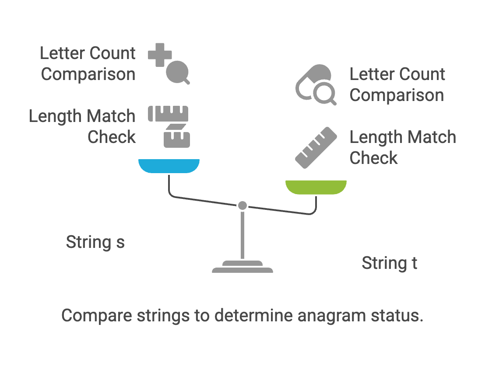
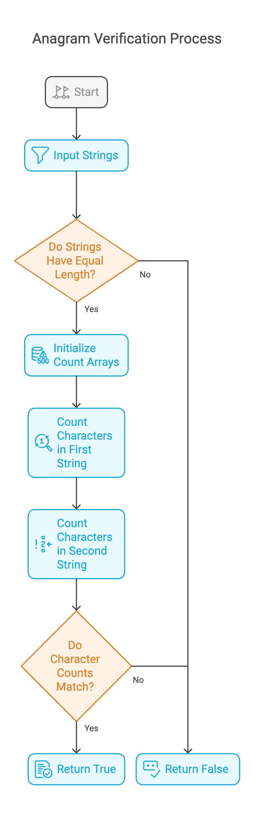

# Problem List

- [242. Valid Anagram](https://leetcode.com/problems/valid-anagram/description/?envType=study-plan-v2&envId=top-interview-150)
  
## Intution
The core idea of this code is to determine if two strings, s and t, are anagrams of each other. An anagram means that both strings contain the same characters with the same frequencies, but possibly in different orders.

~~~~
Example 1:

Input: s = "anagram", t = "nagaram"

Output: true

Example 2:

Input: s = "rat", t = "car"

Output: false
~~~~

## Approaches

### Hash Table  Approach

<code>Pros:</code>
    - Efficiency:* The O(m+n) 
    - Optimized Lookups O(2 * SIZE)
### Algorithm :

1. Checks if the strings have the same length.
2. Counts the occurrences of each lowercase letter in both strings.
3. Compares the letter counts.
4. If all letter counts are the same, the strings are anagrams.

#### Solution
~~~c
/*
242. Valid Anagram
*/

#include <stdio.h>
#include<string.h>
#define MAX 50001 // string max length
#define SIZE 26 // max lowercase char in english alphabit
int isAnagram(char *s, char *t)
{
	int len_s = strlen(s);
	int len_t = strlen(t);

	if(len_s!=len_t)
		return 0;
	int sCount[SIZE] = {0}, tCount[SIZE]= {0};
	for (int i = 0; i < len_s; i++)
	{
		sCount[s[i]-'a']++;

	}
	for (int i = 0; i < len_t; i++)
	{
		tCount[t[i]-'a']++;

	}

	for(int i = 0; i<SIZE; i++)

	{
		if(sCount[i]!=tCount[i])
			return 0;
	}
	return 1;

}

int main()
{
	char s[] = "rat", t[] = "car";
	printf("%d", isAnagram(s, t));
	return 0;
}
~~~

