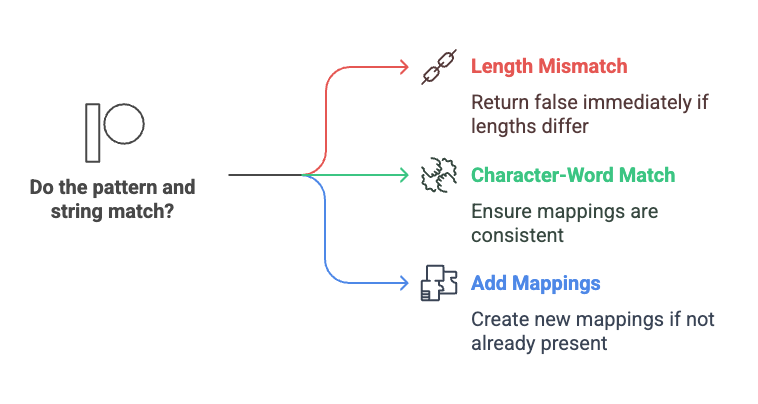
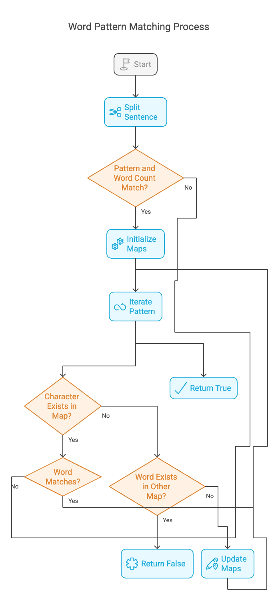

# Problem 

  - [290. Word Pattern](https://leetcode.com/problems/word-pattern/description/?envType=study-plan-v2&envId=top-interview-150)`easy`
  
## Intution

We need to check if a given pattern and a string s follow the same mapping. This means: 
1. Each character in pattern should map to a unique word in s.
2. Each word in s should map back to the same character in pattern.

~~~~
Example 1:

Input: pattern = "abba", s = "dog cat cat dog"

Output: true

Explanation:

The bijection can be established as:

'a' maps to "dog".
'b' maps to "cat".
Example 2:

Input: pattern = "abba", s = "dog cat cat fish"

Output: false

Example 3:

Input: pattern = "aaaa", s = "dog cat cat dog"

Output: false
~~~~

## Approaches

### Hash Table  Approach

<code>Pros:</code>

- Efficiency:* O(N)
- Optimized Lookups O(N)
  
### Algorithm 

We'll use two HashMaps to maintain a bidirectional mapping:

`m1`: Maps characters in pattern → words in s.

`m2`: Maps words in s → characters in pattern.

Steps:
1. Split s into words.
2. If pattern.length() ≠ number of words, return false immediately.
3. Iterate through pattern and words, checking both HashMaps:

- If a character is already mapped, it should match the corresponding word.

- If a word is already mapped, it should match the corresponding character.

4. If not mapped, add both mappings.
- If all checks pass, return `true`
  

#### Solution
~~~cpp

#include <bits/stdc++.h>
using namespace std;
class Solution {
public:
	vector<string> split_sentence(string sen) {

		// Create a stringstream object
		stringstream ss(sen);

		// Variable to hold each word
		string word;

		// Vector to store the words
		vector<string> words;

		// Extract words from the sentence
		while (ss >> word) {

			// Add the word to the vector
			words.push_back(word);
		}

		return words;
	}

	bool wordPattern(string pattern, string s) {

		//Call the function to split the sentence
		vector<string> words = split_sentence(s);

		//if number of char in pattern dosen't match
		//with number of words in words
		if (pattern.size() != words.size()) return false;

		unordered_map<char, string> m1;
		unordered_map<string, char> m2;

		// iterate over pattern
		for (int i = 0; i < pattern.size(); i++) {
			char ch = pattern[i];
			string word = words[i];

			// check if ch already exist in m1
			if (m1.count(ch)) {

				//value doesn't match with current word
				if (m1[ch] != word) return false;
			}
			// if ch doesn't exist in m1,
			else {
				// check if word already exist in m2
				if (m2.count(word)) {

					//value doesn't match with current ch
					if (m2[word] != ch) return false;
				}
				// first ocurance update hash table for both m1 & m2
				m1[ch] = word;
				m2[word] = ch;
			}
		}
		return true;

	}
};
int main()
{
	Solution sol;
	string pattern = "abba", s = "dog cat cat dog";

	cout << sol.wordPattern(pattern, s);

	return 0;
}
~~~

