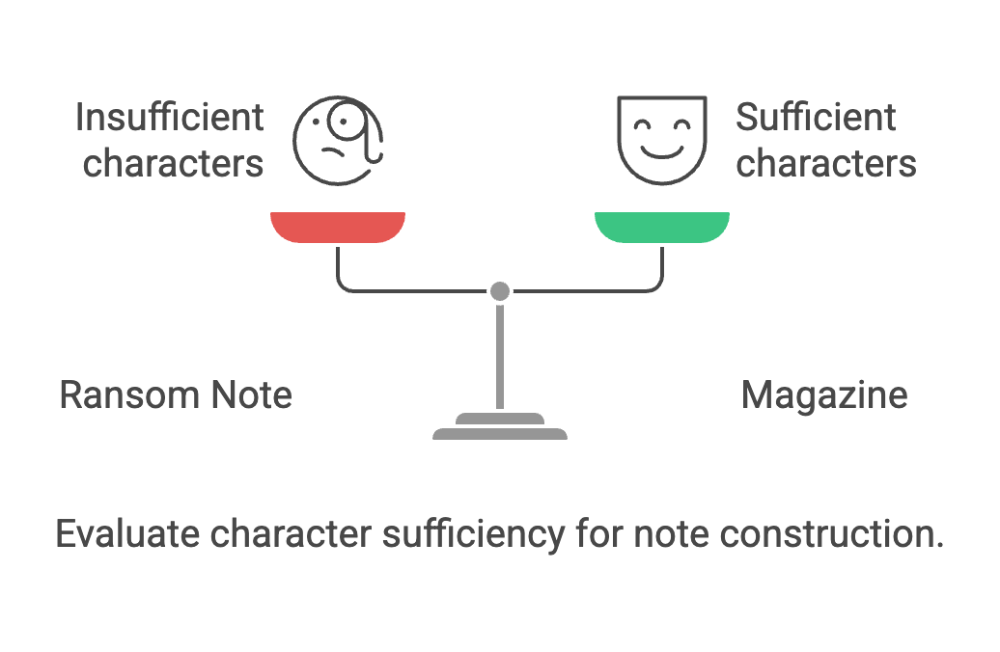
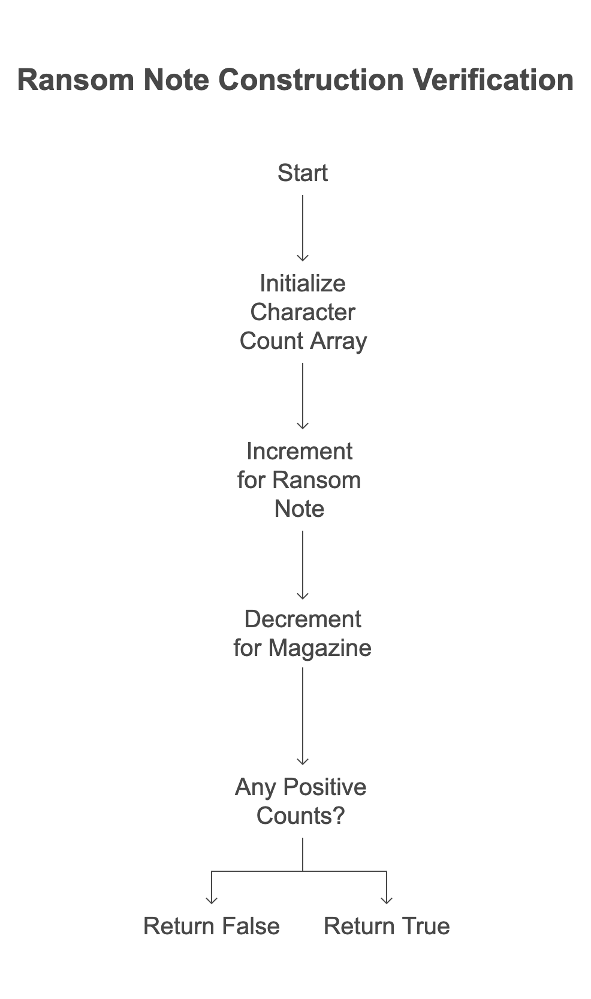

# Problem List

- [383. Ransom Note](https://leetcode.com/problems/ransom-note/description/?envType=study-plan-v2&envId=top-interview-150)`easy`

## Intution
The core idea is to see if the magazine string provides enough of each character to construct the ransomNote. Think of the magazine as a pool of letters you can use, and the ransomNote as a word you want to build.

Example 1: ransomNote = "a", magazine = "b"

The ransomNote needs an 'a'.
The magazine only has a 'b'.
Since 'a' is not in the magazine, you can't construct the ransomNote. Therefore, the output is false.
Example 2: ransomNote = "aa", magazine = "ab"

The ransomNote needs two 'a's.
The magazine has one 'a' and one 'b'.
You only have one 'a' in the magazine, but you need two. You're missing an 'a'. Therefore, the output is false.
Example 3: ransomNote = "aa", magazine = "aab"

The ransomNote needs two 'a's.
The magazine has two 'a's and one 'b'.
The magazine has enough 'a's (and extra 'b') to construct the ransomNote. Therefore, the output is true.

### Algorithm :

1.  **Initialization:**
    * Calculate the lengths of the `ransomNote` and `magazine` strings.
    * It creates an integer array `a` of size 26, initialized to all zeros. This array will act as a frequency counter for lowercase English letters.

2.  **Counting Ransom Note Characters:**
    * It iterates through the `ransomNote` string.
    * For each character in `ransomNote`, it calculates its index in the `a` array by subtracting the ASCII value of 'a' from the character's ASCII value (e.g., 'b' - 'a' = 1, so 'b' corresponds to index 1).
    * It increments the value at the calculated index in the `a` array, effectively counting the frequency of each character in `ransomNote`.

3.  **Decrementing Magazine Characters:**
    * It iterates through the `magazine` string.
    * For each character in `magazine`, it calculates its index in the `a` array in the same way as before.
    * It decrements the value at the calculated index in the `a` array, effectively subtracting the frequency of each character found in magazine.

4.  **Checking for Remaining Ransom Note Characters:**
    * It iterates through the `a` array.
    * If any element in `a` is greater than 0, it means that the `ransomNote` contains a character that appears more times than it does in the `magazine`. In this case, it returns 0 (false).

5.  **Construction Possible:**
    * If the loop finishes without finding any positive values in `a`, it means that all characters in `ransomNote` can be constructed from `magazine`. In this case, it returns 1 (true).

In essence, the algorithm uses a frequency counting approach to check if the `magazine` string contains enough characters to build the `ransomNote` string.

## Approaches

### Hash Table  Approach

<code>Pros:</code>

    - Efficiency:* The O(m+n) 
    - Optimized Lookups

#### Solution
~~~c
#include <stdio.h>
#include <string.h>
#define SIZE 26 // lowercase English letters.
int canConstruct(char *ransomNote, char *magazine)
{

    int len_ransome = strlen(ransomNote);
    int len_magazine = strlen(magazine);
    int a[SIZE] = {};

    // increment the value of each char index
    for (int i = 0; i < len_ransome; i++)
        a[ransomNote[i] - 'a']++;

    // deccrement the value of each char index
    for (int i = 0; i < len_magazine; i++)
    {
        a[magazine[i] - 'a']--;
    }

    for (int i = 0; i < SIZE; i++)
        if (a[i] > 0)
            return 0;

    return 1;
}

int main()
{

    char ransomNote[] = "a", magazine[] = "b";
    int res = canConstruct(ransomNote, magazine);
    printf("%d", res);
    return 0;
}
~~~

