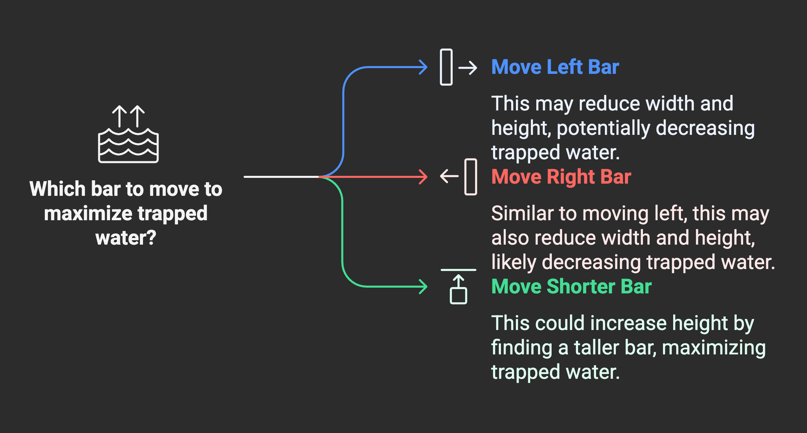
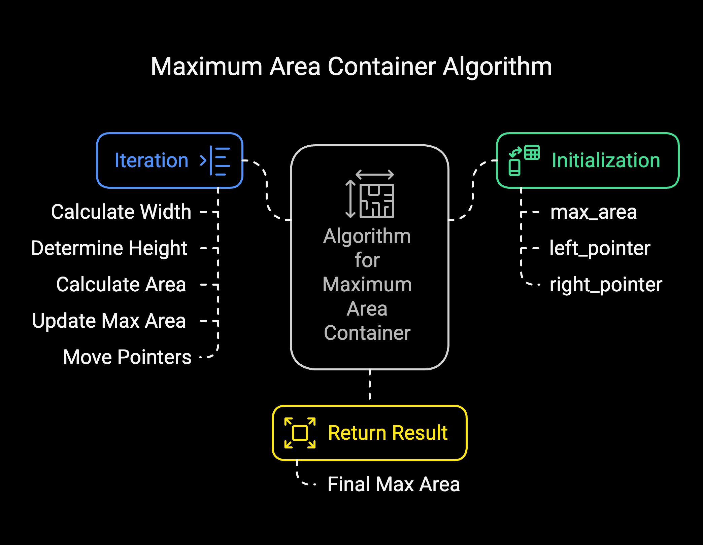

# Problem

- [11 Container With Most Water](https://leetcode.com/problems/container-with-most-water/)`Medium`

## Intuition:

Imagine you have a series of vertical bars with different heights. You want to find the largest amount of water you can trap between any two of these bars.

Think of it like this:

Start with the widest possible container: Pick the bar at the far left and the bar at the far right. The distance between them is your initial width. The height of the water they can hold is limited by the shorter of the two bars.

Consider if you can do better:

If you move the taller bar inwards, the width will definitely decrease. The height might stay the same or even get smaller if the new bar is shorter. So, moving the taller bar is unlikely to increase the trapped water.

However, if you move the shorter bar inwards, the width will decrease, but there's a chance that you might encounter a taller bar that could increase the height of the water you can trap.

The Strategy: Based on this idea, the best approach is to:

Calculate the area formed by the leftmost and rightmost bars.
Then, move the shorter of the two bars one step inwards.
Repeat this process, always moving the shorter bar, and keep track of the largest area you've seen so far.
By always moving the shorter bar, you're exploring the possibilities of increasing the height of your container, which is crucial for maximizing the trapped water. You continue this until the two bars meet in the middle. The largest area you recorded during this process is the maximum area of water you can trap.

```plain
Example 1:
Input: height = [1,8,6,2,5,4,8,3,7]
Output: 49
Explanation: The above vertical lines are represented by array [1,8,6,2,5,4,8,3,7]. In this case, the max area of water (blue section) the container can contain is 49.
Example 2:

Input: height = [1,1]
Output: 1
```


### Algorithm :

## Finding the Container with the Most Water 

This algorithm calculates the maximum area of a container formed by two vertical lines, where the width of the container is the distance between the lines, and the height is determined by the shorter of the two lines. The heights of the lines are given in an array `height`.

1.  **Initialization:**
    * Initialize a variable `max_area` to 0. This variable will store the maximum area found so far.
    * Initialize a pointer `left` to the beginning of the `height` array (index 0).
    * Initialize a pointer `right` to the end of the `height` array (index `heightSize - 1`).

2.  **Iteration:**
    * While `left` is less than `right`:
        * Calculate the `current_width` of the container as the distance between the `left` and `right` pointers: `current_width = right - left`.
        * Determine the `current_height` of the container. This is the minimum of the heights of the lines at the `left` and `right` pointers: `current_height = min(height[left], height[right])`.
        * Calculate the `area` of the current container: `area = current_height * current_width`.
        * **Update Maximum Area:** If the calculated `area` is greater than the current `max_area`, update `max_area` to this new `area`.
        * **Move Pointers:**
            * If the height of the line at the `left` pointer is less than the height of the line at the `right` pointer (`height[left] < height[right]`):
                * Move the `left` pointer one step to the right (`left++`). The intuition here is that by moving the shorter line, we have a chance of finding a taller line that could potentially increase the area.
            * Otherwise (if `height[left]` is greater than or equal to `height[right]`):
                * Move the `right` pointer one step to the left (`right--`). Similarly, moving the shorter or equal height line might lead to a larger area.

3.  **Return Result:**
    * After the `while` loop finishes (when `left` is no longer less than `right`), return the final `max_area`. This will be the maximum area of the container that can be formed by any two lines in the input array.





## Approaches

Two-Pointer Approach
<code>Complexity</code>

- Time complexity: O(n)
- space complexity: O(1)


#### Solution
```c
#include <stdio.h>

int maxArea(int* height, int heightSize) {
	int max_area = 0;
	int left = 0;
	int right = heightSize - 1;

	while (left < right) {
		int width = right - left;
		int current_height = (height[left] < height[right]) ? height[left] : height[right];
		int area = current_height * width;
		if (area > max_area) {
			max_area = area;
		}

		if (height[left] < height[right]) {
			left++;
		} else {
			right--;
		}
	}
	return max_area;
}

int main() {
	int height[] = {1, 8, 6, 2, 5, 4, 8, 3, 7};
	int heightSize = sizeof(height) / sizeof(height[0]);
	printf("%d\n", maxArea(height, heightSize));
	return 0;
}
```


### Dry Run:

**Example 1: height = [1, 8, 6, 2, 5, 4, 8, 3, 7]**

1.  `left = 0`, `right = 8` (size - 1), `max_area = 0`.
2.  `width = 8 - 0 = 8`, `height = min(height[0], height[8]) = min(1, 7) = 1`, `area = 1 * 8 = 8`. `max_area = 8`. Since `height[0] < height[8]`, `left` becomes 1.
3.  `left = 1`, `right = 8`, `width = 8 - 1 = 7`, `height = min(height[1], height[8]) = min(8, 7) = 7`, `area = 7 * 7 = 49`. `max_area = 49`. Since `height[1] > height[8]`, `right` becomes 7.
4.  `left = 1`, `right = 7`, `width = 7 - 1 = 6`, `height = min(height[1], height[7]) = min(8, 3) = 3`, `area = 3 * 6 = 18`. `max_area = 49`. Since `height[1] > height[7]`, `right` becomes 6.
5.  `left = 1`, `right = 6`, `width = 6 - 1 = 5`, `height = min(height[1], height[6]) = min(8, 8) = 8`, `area = 8 * 5 = 40`. `max_area = 49`. Since `height[1] <= height[6]`, `right` becomes 5.
6.  `left = 1`, `right = 5`, `width = 5 - 1 = 4`, `height = min(height[1], height[5]) = min(8, 4) = 4`, `area = 4 * 4 = 16`. `max_area = 49`. Since `height[1] > height[5]`, `right` becomes 4.
7.  `left = 1`, `right = 4`, `width = 4 - 1 = 3`, `height = min(height[1], height[4]) = min(8, 5) = 5`, `area = 5 * 3 = 15`. `max_area = 49`. Since `height[1] > height[4]`, `right` becomes 3.
8.  `left = 1`, `right = 3`, `width = 3 - 1 = 2`, `height = min(height[1], height[3]) = min(8, 2) = 2`, `area = 2 * 2 = 4`. `max_area = 49`. Since `height[1] > height[3]`, `right` becomes 2.
9.  `left = 1`, `right = 2`, `width = 2 - 1 = 1`, `height = min(height[1], height[2]) = min(8, 6) = 6`, `area = 6 * 1 = 6`. `max_area = 49`. Since `height[1] > height[2]`, `right` becomes 1.
10. `left = 1`, `right = 1`. The loop condition `left < right` is false, so the loop terminates.
11. The function returns `max_area`, which is 49.

**Example 2: height = [1, 1]**

1.  `left = 0`, `right = 1` (size - 1), `max_area = 0`.
2.  `width = 1 - 0 = 1`, `height = min(height[0], height[1]) = min(1, 1) = 1`, `area = 1 * 1 = 1`. `max_area = 1`. Since `height[0] <= height[1]`, `right` becomes 0.
3.  `left = 0`, `right = 0`. The loop condition `left < right` is false, so the loop terminates.
4.  The function returns `max_area`, which is 1.
