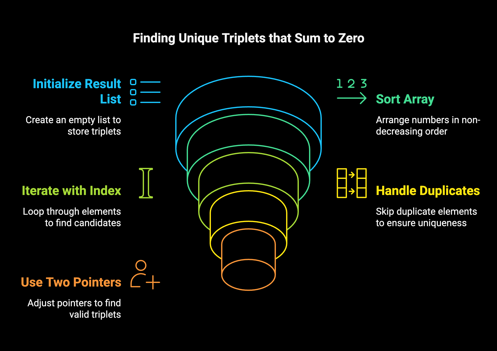

# Problem

- [15. 3Sum](https://leetcode.com/problems/3sum/)`Medium`

## Intuition:


The 3Sum problem asks us to find all unique combinations of three numbers in a given array that add up to zero. 

**1. The Core Idea: Reducing to a 2Sum Problem**

Imagine we fix one number from the array. Let's say we pick a number `nums[i]`. Now, the problem reduces to finding two other numbers in the *rest* of the array that sum up to `-nums[i]`. This is essentially the classic "2Sum" problem.

**2. Leveraging Sorting for Efficiency**

To efficiently solve this reduced 2Sum problem, the first crucial step is to **sort the input array `nums`**. Sorting allows us to use a clever two-pointer technique.

**3. The Outer Loop: Fixing the First Number**

The outer `for` loop iterates through each number in the sorted array. For each number `nums[i]`, we consider it as the first element of our potential triplet.

**4. Avoiding Duplicate First Numbers**

The condition `if (i > 0 && nums[i] == nums[i-1]) { continue; }` is important for handling duplicate numbers. Since the array is sorted, if the current number is the same as the previous one, we've already considered all possible triplets starting with that value in the previous iteration. Skipping duplicates here prevents adding the same triplet multiple times to our result.

**5. The Two-Pointer Approach (Inner Loop): Finding the Remaining Two Numbers**

For each fixed `nums[i]`, we use two pointers:

* `start`: Initialized to `i + 1` (the next element after `nums[i]`).
* `end`: Initialized to the last index of the array.

These two pointers will help us find the other two numbers that sum up to `-nums[i]`.

**6. Moving the Pointers Based on the Sum**

Inside the `while (start < end)` loop, we calculate the `total` sum of `nums[i]`, `nums[start]`, and `nums[end]`.

* **If `total > 0`:** This means the sum is too large. Since the array is sorted, to decrease the sum, we need to consider a smaller number. We achieve this by decrementing the `end` pointer, moving it to the left.

* **If `total < 0`:** This means the sum is too small. To increase the sum, we need to consider a larger number. We achieve this by incrementing the `start` pointer, moving it to the right.

* **If `total == 0`:** We've found a triplet that sums to zero! We add this triplet `{nums[i], nums[start], nums[end]}` to our result `res`.

**7. Skipping Duplicate Second Numbers**

After finding a valid triplet, we increment the `start` pointer to look for other possible triplets. The `while (nums[start] == nums[start-1] && start < end) { start++; }` condition is crucial for avoiding duplicate triplets that only differ in the second number. Since the array is sorted, if the current `nums[start]` is the same as the previous one, we skip it to avoid adding the same triplet again.

**In Summary:**

The algorithm works by systematically fixing one number and then efficiently finding the other two numbers that complete the zero-sum triplet using a two-pointer approach on a sorted array. The duplicate checks ensure that we only collect unique triplets in our result. This approach significantly reduces the time complexity compared to a brute-force solution of checking all possible combinations of three numbers.


```plain
Example 1:

Input: nums = [-1,0,1,2,-1,-4]
Output: [[-1,-1,2],[-1,0,1]]
Explanation: 
nums[0] + nums[1] + nums[2] = (-1) + 0 + 1 = 0.
nums[1] + nums[2] + nums[4] = 0 + 1 + (-1) = 0.
nums[0] + nums[3] + nums[4] = (-1) + 2 + (-1) = 0.
The distinct triplets are [-1,0,1] and [-1,-1,2].
Notice that the order of the output and the order of the triplets does not matter.
Example 2:

Input: nums = [0,1,1]
Output: []
Explanation: The only possible triplet does not sum up to 0.
Example 3:

Input: nums = [0,0,0]
Output: [[0,0,0]]
Explanation: The only possible triplet sums up to 0.
```


### Algorithm :

**Steps:**

1.  **Initialize an empty list called `result`** to store the triplets that satisfy the condition.

2.  **Sort the input array `nums` in non-decreasing order.** This step is crucial for efficiently finding triplets and handling duplicates.

3.  **Iterate through the sorted array `nums` using a loop with an index `i` from 0 to `nums.size() - 3` (inclusive).** We stop at the third-to-last element because we need at least three numbers to form a triplet.

4.  **Handle Duplicate First Numbers:** Inside the outer loop, check if the current element `nums[i]` is the same as the previous element `nums[i-1]`. If it is (and if `i > 0`), skip the current iteration using `continue`. This prevents adding duplicate triplets where only the first number is the same.

5.  **Initialize Two Pointers:** For each `nums[i]`, initialize two pointers:
    * `start = i + 1` (pointing to the element immediately after `nums[i]`).
    * `end = nums.size() - 1` (pointing to the last element of the array).

6.  **Use a `while` loop that continues as long as `start < end`.** This loop will explore potential second and third numbers for the triplet.

7.  **Calculate the Sum:** Inside the `while` loop, calculate the sum of the three numbers: `total = nums[i] + nums[start] + nums[end]`.

8.  **Adjust Pointers Based on the Sum:**
    * **If `total > 0`:** The sum is too large. To decrease the sum, we need to consider a smaller number. Since the array is sorted, decrement the `end` pointer (`end--`).
    * **If `total < 0`:** The sum is too small. To increase the sum, we need to consider a larger number. Increment the `start` pointer (`start++`).
    * **If `total == 0`:** We have found a triplet that sums to zero.
        * Add the triplet `[nums[i], nums[start], nums[end]]` to the `result` list.
        * Increment the `start` pointer (`start++`) to look for other possible triplets.
        * **Handle Duplicate Second Numbers:** After finding a valid triplet, skip any subsequent duplicate numbers at the `start` position. While `start < end` and `nums[start]` is equal to the previous element `nums[start-1]`, increment `start`. This prevents adding duplicate triplets where the first and third numbers are the same, but the second number is a duplicate.

9.  **After the outer loop finishes, return the `result` list.** This list will contain all the unique triplets that sum up to zero.


## Approaches

Two-Pointer Approach
<code>Complexity</code>

- Time complexity: O(n^2)
- space complexity: O(n)


#### Solution
```cpp
#include<bits/stdc++.h>
using namespace std;
class Solution {
public:
    vector<vector<int>> threeSum(vector<int>& nums) {
          vector<vector<int>> res;
        sort(nums.begin(), nums.end());

        for (int i = 0; i < nums.size(); i++) {
            if (i > 0 && nums[i] == nums[i-1]) {
                continue;
            }
            
            int start = i + 1;
            int end = nums.size() - 1;

            while (start < end) {
                int total = nums[i] + nums[start] + nums[end];

                if (total > 0) {
                    end--;
                } else if (total < 0) {
                    start++;
                } else {
                    res.push_back({nums[i], nums[start], nums[end]});
                    start++;

                    while (nums[start] == nums[start-1] && start < end) {
                        start++;
                    }
                    
                }
            }
        }
        return res;
    }
};
int main()
{
    vector<int>nums = {-1,0,1,2,-1,-4};
    vector<vector<int>> res;
    Solution sol;
    res = sol.threeSum(nums);
    for(auto i: res)
    {
        for(auto j:i){
            cout<<j<<" ";
        }
        cout<<endl;
    }
    return 0;
}
```


## Dry Run of the 3Sum Algorithm with `nums = [-1, 0, 1, 2, -1, -4]`

**1. Sort the input array `nums`:**
   `nums` becomes `[-4, -1, -1, 0, 1, 2]`

**2. Initialize `result = []`**

**3. Outer loop (iterating with index `i`):**

   * **`i = 0`, `nums[i] = -4`:**
      * `start = i + 1 = 1`, `end = nums.size() - 1 = 5`
      * `while start < end` (1 < 5):
         * `total = nums[0] + nums[1] + nums[5] = -4 + (-1) + 2 = -3`
         * `total < 0`, so `start++` (`start` becomes 2)
      * `while start < end` (2 < 5):
         * `total = nums[0] + nums[2] + nums[5] = -4 + (-1) + 2 = -3`
         * `total < 0`, so `start++` (`start` becomes 3)
      * `while start < end` (3 < 5):
         * `total = nums[0] + nums[3] + nums[5] = -4 + 0 + 2 = -2`
         * `total < 0`, so `start++` (`start` becomes 4)
      * `while start < end` (4 < 5):
         * `total = nums[0] + nums[4] + nums[5] = -4 + 1 + 2 = -1`
         * `total < 0`, so `start++` (`start` becomes 5)
      * `while start < end` (5 < 5) is false, inner loop ends.

   * **`i = 1`, `nums[i] = -1`:**
      * `start = i + 1 = 2`, `end = nums.size() - 1 = 5`
      * **Duplicate check:** `nums[1] == nums[0]` (-1 == -4) is false, so we proceed.
      * `while start < end` (2 < 5):
         * `total = nums[1] + nums[2] + nums[5] = -1 + (-1) + 2 = 0`
         * `total == 0`, so add `[-1, -1, 2]` to `result`. `result = [[-1, -1, 2]]`
         * `start++` (`start` becomes 3)
         * **Skip duplicates:** `nums[3] == nums[2]` (0 == -1) is false.
      * `while start < end` (3 < 5):
         * `total = nums[1] + nums[3] + nums[5] = -1 + 0 + 2 = 1`
         * `total > 0`, so `end--` (`end` becomes 4)
      * `while start < end` (3 < 4):
         * `total = nums[1] + nums[3] + nums[4] = -1 + 0 + 1 = 0`
         * `total == 0`, so add `[-1, 0, 1]` to `result`. `result = [[-1, -1, 2], [-1, 0, 1]]`
         * `start++` (`start` becomes 4)
         * **Skip duplicates:** `nums[4] == nums[3]` (1 == 0) is false.
      * `while start < end` (4 < 4) is false, inner loop ends.

   * **`i = 2`, `nums[i] = -1`:**
      * **Duplicate check:** `nums[2] == nums[1]` (-1 == -1) is true, so `continue` to the next iteration.

   * **`i = 3`, `nums[i] = 0`:**
      * `start = i + 1 = 4`, `end = nums.size() - 1 = 5`
      * `while start < end` (4 < 5):
         * `total = nums[3] + nums[4] + nums[5] = 0 + 1 + 2 = 3`
         * `total > 0`, so `end--` (`end` becomes 4)
      * `while start < end` (4 < 4) is false, inner loop ends.

   * **`i = 4`, `nums[i] = 1`:**
      * `start = i + 1 = 5`, `end = nums.size() - 1 = 5`
      * `while start < end` (5 < 5) is false, inner loop ends.

**4. Return `result`:**

The final `result` is `[[-1, -1, 2], [-1, 0, 1]]`. This matches the expected output.