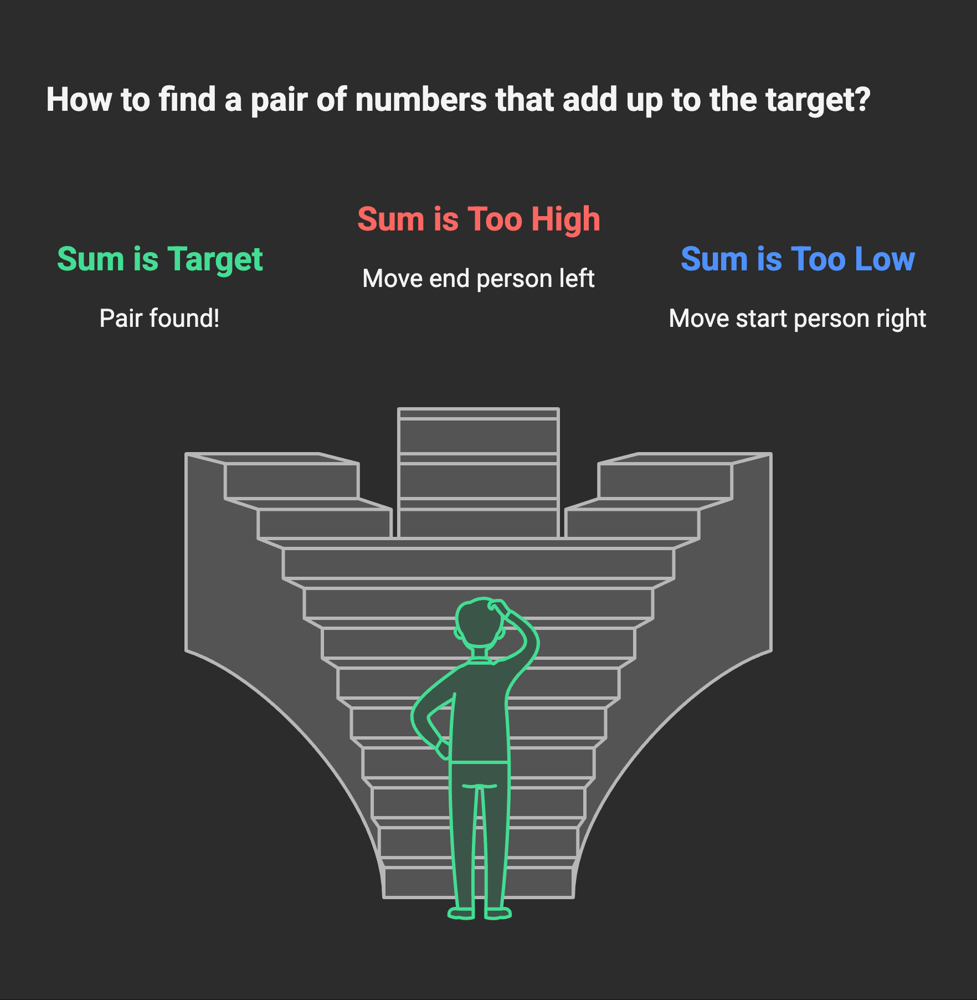
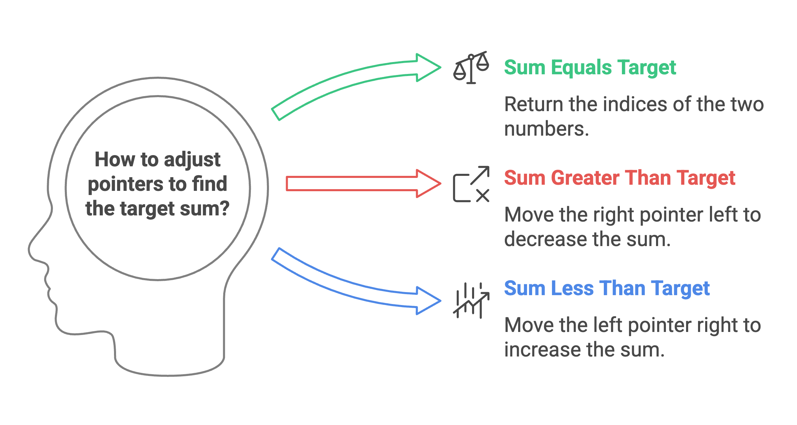

# Problem

- [167. Two Sum II - Input Array Is Sorted](https://leetcode.com/problems/two-sum-ii-input-array-is-sorted/)`Medium`

## Intuition:

Imagine you have a sorted line of people, and each person has a number tag. You want to find two people whose number tags add up to a specific target number.

Instead of checking every possible pair of people, you can be smarter:

Start with one person at the very beginning of the line and another at the very end.
Check the sum of their number tags.
If the sum is exactly what you're looking for (the target), you've found your pair!
If the sum is too high, it means the person at the end has too large a number. Since the line is sorted, you can try the person just before them.
If the sum is too low, it means the person at the beginning has too small a number. You can try the person just after them.
Keep doing this, moving the "start" person forward and the "end" person backward, until you find the pair or they meet in the middle.

```plain
Example 1:

Input: numbers = [2,7,11,15], target = 9
Output: [1,2]
Explanation: The sum of 2 and 7 is 9. Therefore, index1 = 1, index2 = 2. We return [1, 2].
Example 2:

Input: numbers = [2,3,4], target = 6
Output: [1,3]
Explanation: The sum of 2 and 4 is 6. Therefore index1 = 1, index2 = 3. We return [1, 3].
Example 3:

Input: numbers = [-1,0], target = -1
Output: [1,2]
Explanation: The sum of -1 and 0 is -1. Therefore index1 = 1, index2 = 2. We return [1, 2].
```




### Algorithm :

This algorithm finds two numbers in a **sorted** array that add up to a specific target value.

1.  **Initialization:**
    * Initialize a pointer `left` to the beginning of the `numbers` array (index 0).
    * Initialize a pointer `right` to the end of the `numbers` array (index `size - 1`, where `size` is the number of elements in the array).

2.  **Iteration:**
    * While `left` is less than `right`:
        * Calculate the `current_sum` by adding the numbers at the `left` and `right` pointers: `current_sum = numbers[left] + numbers[right]`.
        * **Comparison:**
            * If `current_sum` is equal to the `target`:
                * Return the 1-based indices of the two numbers: `{left + 1, right + 1}`.
            * If `current_sum` is greater than the `target`:
                * To decrease the `current_sum`, move the `right` pointer one step to the left: `right--`. (Since the array is sorted, moving the right pointer to a smaller element will decrease the sum).
            * If `current_sum` is less than the `target`:
                * To increase the `current_sum`, move the `left` pointer one step to the right: `left++`. (Since the array is sorted, moving the left pointer to a larger element will increase the sum).

3.  **No Solution:**
    * If the `while` loop finishes without finding a pair that sums to the `target` (i.e., `left` becomes greater than or equal to `right`), return `{-1, -1}` (or an appropriate indicator that no solution was found).



## Approaches

Two-Pointer Approach
<code>Complexity</code>

- Time complexity: O(n)
- space complexity: O(1)


#### Solution
```cpp
#include<bits/stdc++.h>
using namespace std;

class Solution {
public:
	vector<int> twoSum(vector<int>& numbers, int target) {
		int size = numbers.size();
		int j = 0;
		int k=size-1;
		for(int i =0; i<size; i++)
		{
			if(numbers[j]+numbers[k]==target)
				return {j+1,k+1};
			else if(numbers[j]+numbers[k]>target)
				    k--;
			else
				j++;
		    if(j>k)
				break;
		}
		return {-1,-1};// no Solution for debug pourpose
	}
};

int main()

{
	vector<int>  numbers = {-1,0};
	int target = -1;
	Solution sol;
	vector<int>  idx;
	idx = sol.twoSum(numbers,target);
    for(auto i:idx)
        cout<<i<<" ";
	return 0;
}
```

### Dry Run:

**Example 1: numbers = [2, 7, 11, 15], target = 9**

1.  `left = 0`, `right = 3` (size - 1).
2.  `current_sum = numbers[0] + numbers[3] = 2 + 15 = 17`.
3.  `17 > 9`, so `right` becomes `2`.
4.  `current_sum = numbers[0] + numbers[2] = 2 + 11 = 13`.
5.  `13 > 9`, so `right` becomes `1`.
6.  `current_sum = numbers[0] + numbers[1] = 2 + 7 = 9`.
7.  `9 == 9`, so return `{0 + 1, 1 + 1}` which is `[1, 2]`.

**Example 2: numbers = [2, 3, 4], target = 6**

1.  `left = 0`, `right = 2` (size - 1).
2.  `current_sum = numbers[0] + numbers[2] = 2 + 4 = 6`.
3.  `6 == 6`, so return `{0 + 1, 2 + 1}` which is `[1, 3]`.

**Example 3: numbers = [-1, 0], target = -1**

1.  `left = 0`, `right = 1` (size - 1).
2.  `current_sum = numbers[0] + numbers[1] = -1 + 0 = -1`.
3.  `-1 == -1`, so return `{0 + 1, 1 + 1}` which is `[1, 2]`.