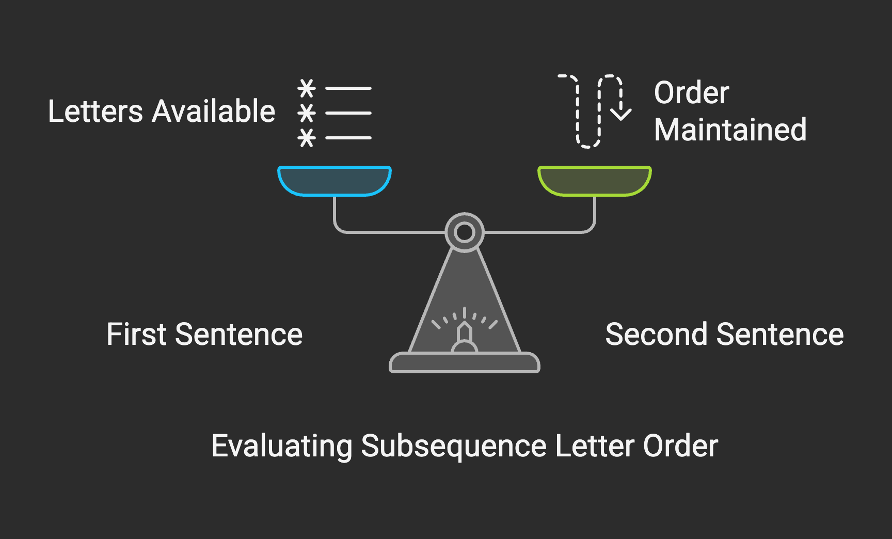
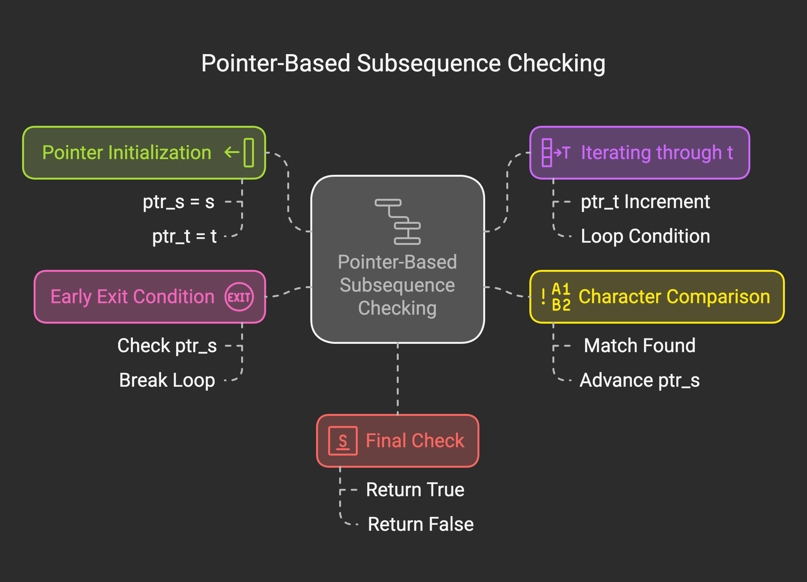
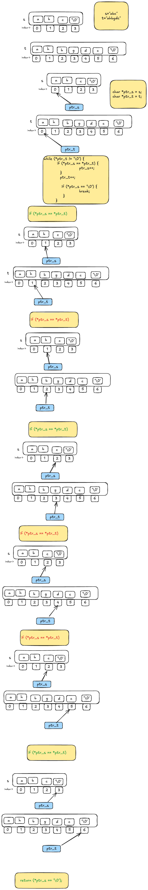

# Problem

- [392. Is Subsequence](https://leetcode.com/problems/is-subsequence/)`Easy`

## Intuition:

Imagine you have two sentences. The isSubsequence function checks if you can spell out the first sentence by picking letters from the second sentence in order, skipping some letters if needed.

```plain
Example 1:

Input: s = "abc", t = "ahbgdc"
Output: true
Example 2:

Input: s = "axc", t = "ahbgdc"
Output: false
```




### Algorithm :

Think of pointers as directly pointing to the memory locations of the characters in the strings. Instead of using indices to access characters, we'll move these pointers along the strings.

**Pointer Initialization:**

`char *ptr_s = s`;: We create a pointer `ptr_s` and make it point to the beginning of the string s.
`char *ptr_t = t`;: Similarly, `ptr_t` points to the beginning of string t.
**Iterating through t using a Pointer:**

`while (*ptr_t != '\0')`: This loop continues as long as the character pointed to by ptr_t is not the null terminator `(\0)`, which marks the end of the string t.
Comparing Characters at Pointer Locations:

if `(*ptr_s == *ptr_t)`: Inside the loop, we compare the character currently pointed to by ptr_s with the character pointed to by ptr_t. The * operator dereferences the pointer, giving us the actual character at that memory location.

**Match Found - Advance ptr_s:**

`ptr_s++`;: If the characters match, it means we've found a character from s in t in the correct order. So, we increment `ptr_s` to make it point to the next character in s that we need to find.

**Advance ptr_t in Every Iteration:**

`ptr_t++;`: Regardless of whether there was a match or not, we always increment ptr_t to move to the next character in t to continue our search.

**Early Exit if s is Exhausted:**

if `(*ptr_s == '\0') { break; }`: After potentially incrementing ptr_s, we check if it has reached the end of string s (i.e., it points to the null terminator). If it has, it means we have found all characters of s in t, so we can exit the loop early as we already know s is a subsequence of t.
Final Check:

`return (*ptr_s == '\0');`: After the loop finishes (either by reaching the end of t or by finding all of s), we check if ptr_s has reached the end of s.
If `*ptr_s == '\0'`, it means we have successfully found all characters of s in t in the correct order, and the function `returns 1 (true)`.
If `*ptr_s` is not `'\0'`, it means we haven't found all characters of s within t, and the function returns 0 (false).
main function remains the same: It initializes two empty strings and calls the isSubsequence function, which will return 1 because an empty string is a subsequence of another empty string. The pointer-based logic correctly handles this case as both ptr_s and ptr_t will initially point to the null terminators, and the final check `(*ptr_s == '\0')` will be true.




## Approaches

<code>Complexity</code>

- Time complexity: O(n)
- space complexity: O(1)


#### Solution
```c
#include <stdio.h>
#include <string.h>
#define MAX 10001
int isSubsequence(char* s, char* t) {
	char *ptr_s = s;
	char *ptr_t = t;

	while (*ptr_t != '\0') {
		if (*ptr_s == *ptr_t) {
			ptr_s++;
		}
		ptr_t++;
		if (*ptr_s == '\0') {
			break;
		}
	}
	return (*ptr_s == '\0');
}
int main() {
	char s[MAX] = "abc";
	char t[MAX] = "ahbgdc";

	printf("%d", isSubsequence(s, t));
	return 0;
}
```


### Dry Run:

**Example 1: s = "abc", t = "ahbgdc"**

1.  Initialize `ptr_s` pointing to 'a' in "abc" and `ptr_t` pointing to 'a' in "ahbgdc".
2.  Compare `*ptr_s` ('a') with `*ptr_t` ('a'). They match.
3.  Increment `ptr_s` to point to 'b' and `ptr_t` to point to 'h'.
4.  Compare `*ptr_s` ('b') with `*ptr_t` ('h'). They don't match.
5.  Increment `ptr_t` to point to 'b'.
6.  Compare `*ptr_s` ('b') with `*ptr_t` ('b'). They match.
7.  Increment `ptr_s` to point to 'c' and `ptr_t` to point to 'g'.
8.  Compare `*ptr_s` ('c') with `*ptr_t` ('g'). They don't match.
9.  Increment `ptr_t` to point to 'd'.
10. Compare `*ptr_s` ('c') with `*ptr_t` ('d'). They don't match.
11. Increment `ptr_t` to point to 'c'.
12. Compare `*ptr_s` ('c') with `*ptr_t` ('c'). They match.
13. Increment `ptr_s` to point to '\0' (end of "abc") and `ptr_t` to point to '\0' (end of "ahbgdc").
14. The `while` loop terminates.
15. The condition `(*ptr_s == '\0')` is true.
16. Output: `true`

**Example 2: s = "axc", t = "ahbgdc"**

1.  Initialize `ptr_s` pointing to 'a' in "axc" and `ptr_t` pointing to 'a' in "ahbgdc".
2.  Compare `*ptr_s` ('a') with `*ptr_t` ('a'). They match.
3.  Increment `ptr_s` to point to 'x' and `ptr_t` to point to 'h'.
4.  Compare `*ptr_s` ('x') with `*ptr_t` ('h'). They don't match.
5.  Increment `ptr_t` to point to 'b'.
6.  Compare `*ptr_s` ('x') with `*ptr_t` ('b'). They don't match.
7.  Increment `ptr_t` to point to 'g'.
8.  Compare `*ptr_s` ('x') with `*ptr_t` ('g'). They don't match.
9.  Increment `ptr_t` to point to 'd'.
10. Compare `*ptr_s` ('x') with `*ptr_t` ('d'). They don't match.
11. Increment `ptr_t` to point to 'c'.
12. Compare `*ptr_s` ('x') with `*ptr_t` ('c'). They don't match.
13. Increment `ptr_t` to point to '\0' (end of "ahbgdc").
14. The `while` loop terminates.
15. The condition `(*ptr_s == '\0')` is false (because `*ptr_s` is still pointing to 'x').
16. Output: `false`